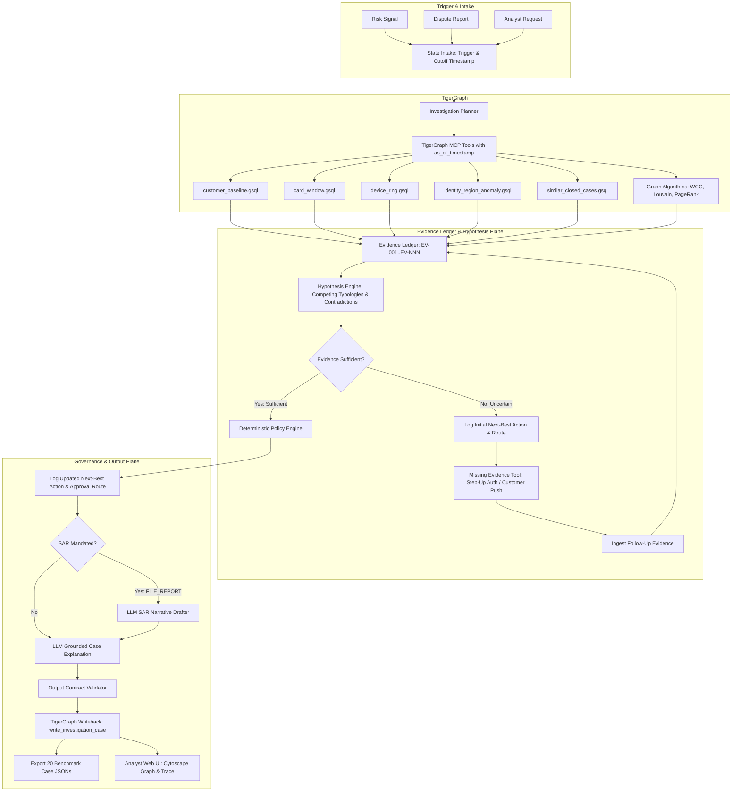
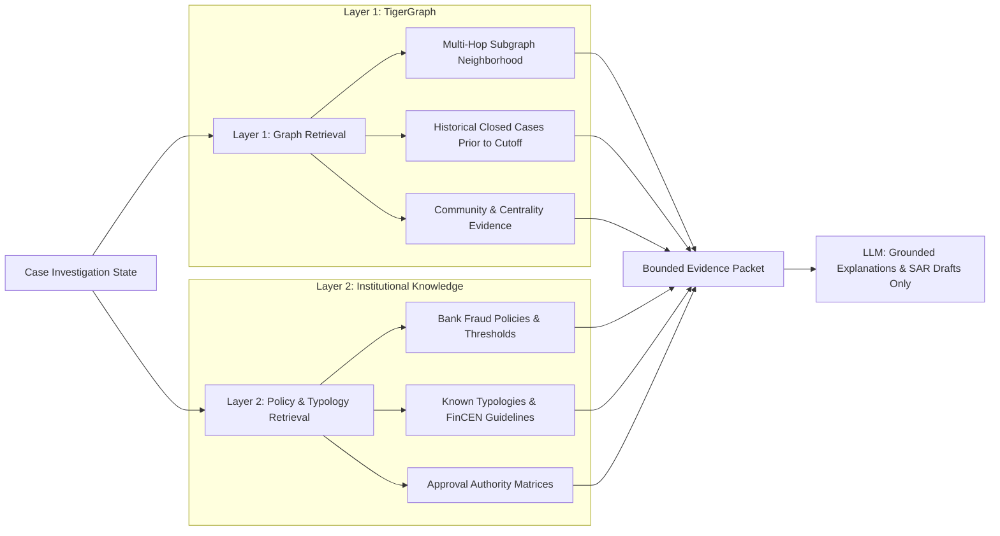
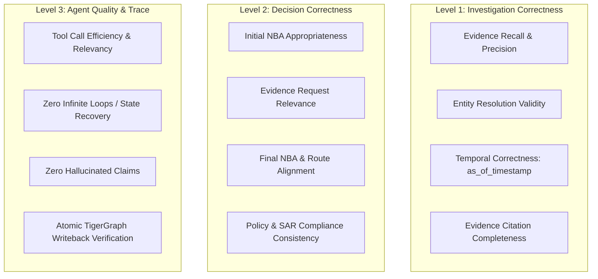

# TigerGraph Agentic Fraud Investigation: Revised End-to-End Implementation Blueprint

**Project Title:** TigerGraph Agentic Fraud Investigation HHGOA  
**Submission Deadline:** September 24, 2026, 11:59 PM IST  
**System Designation:** CaseGuard / GraphSentinel Agentic Fraud Investigator  
**Orchestration Engine:** LangGraph (Stateful Investigation Loop)  
**Evidence & Memory Layer:** TigerGraph Savanna / Community Edition 4.2+ & TigerGraph MCP  
**Grounded Retrieval:** Two-Layer GraphRAG (Graph Topology & Historical Cases + Institutional Policy Rules)  
**Evidence Model:** Structured Evidence Ledger with Competing Hypotheses & Temporal Cutoff  
**Frontend Interface:** React 19 / Vite / TailwindCSS / Cytoscape.js Analyst Console  

---

## 1. Executive Summary & Paradigm Shift

The standard industry approach to fraud detection relies on black-box scoring pipelines:
```
Transaction Data ──> Risk Score ──> Score Threshold ──> Action
```
This is inherently unexplainable, fragile, cannot handle ambiguous edge cases, and treats the bank's preliminary risk score as ground truth—violating the core hackathon requirement.

This project implements a **true evidence-first, hypothesis-evaluating Agentic Fraud Investigation system**:
```
Trigger (Signal/Dispute/Analyst)
       │
       ▼
Investigation Planner
       │
       ▼
TigerGraph Evidence Retrieval (GSQL + Algorithms with as_of_timestamp)
       │
       ▼
Evidence Ledger (Immutable observations, entities, strengths, temporal validity)
       │
       ▼
Hypothesis Engine (Competing typologies vs Legitimate explanations + Contradictions)
       │
       ▼
Evidence Sufficiency Assessment
       ├──[Insufficient]──> Missing Evidence Planner ──> Evidence Request Tool (Step-up / Customer)
       │                                                              │
       ▼                                                              ▼
Initial Next-Best Action & Route                            Reassess with New Evidence
       │                                                              │
       └──────────────────────────────┬───────────────────────────────┘
                                      ▼
                      Deterministic Policy Engine (Grounded in Policy Docs)
                                      ▼
                      Updated Next-Best Action & Governance (auto / L1 / L2 / compliance)
                                      ▼
                      Grounded LLM Explanation & SAR Drafting (Citing verified evidence IDs)
                                      ▼
                      TigerGraph Memory Writeback (Atomically persisted case record)
                                      ▼
                      3-Level Evaluation & Machine-Readable Trace
```

### Core Architectural Axiom:
> **The LLM never determines fraud from a score. The agent investigates graph evidence, evaluates competing hypotheses, tracks contradictions, requests missing evidence when uncertain, and applies deterministic policy.**

---

## 2. Key Architectural Upgrades Over Previous Design

| Dimension | Previous Design | Revised Evidence-First Design | Why It Matters |
|---|---|---|---|
| **Reasoning Model** | Linear score-based pipeline | Stateful investigation loop with hypothesis testing | Truly agentic workflow instead of decorative tool calling |
| **Evidence Representation** | Raw JSON query dumps | **Structured Evidence Ledger** (source, entity, value, strength, supports, contradicts) | 100% auditability, eliminates hallucination |
| **Time Awareness** | Unbounded temporal queries | **Explicit `as_of_timestamp`** cutoffs on all graph queries | Prevents future-data leakage; reflects true investigation state |
| **Graph Algorithms** | Used as black-box verdict generators | **Topological evidence generators** (PageRank/Louvain flag anomalies for hypothesis testing) | Avoids premature, unjustified fraud assertions |
| **Hypothesis Model** | Single classification label | **Competing hypotheses** (e.g., `SHARED_DEVICE_RING` vs `LEGITIMATE_FAMILY_DEVICE`) | Handles real-world ambiguity and surfaces contradictions |
| **Customer Feedback** | Automatic verdict trigger | **Corroborating evidence item** weighed against graph topology | Prevents customer denial from overriding contradicting facts |
| **Policy Source** | Partly hard-coded thresholds | **Authoritative Policy Documents via GraphRAG** | No invented regulatory rules or arbitrary limits |
| **Next-Best Action** | Computed once at the end | **Explicit Initial NBA** (before evidence) and **Updated NBA** (after evidence) | Directly satisfies core hackathon scoring rubric |
| **Evaluation Strategy** | Simple label accuracy | **3-Level Evaluation** (Investigation correctness, Decision correctness, Agent quality) + Trace Evaluator | Evaluates agent behavior, efficiency, and safety |
| **Build Priority** | UI prioritized early | **Engine First, UI Second** | Guarantees all 20 benchmark case files pass before deadline |

---

## 3. High-Level Architecture & Component Separation



---

## 4. The Evidence Ledger Specification

Every observation gathered from TigerGraph, external systems, or customer responses is normalized into an immutable **Evidence Ledger item**:

```json
{
  "evidence_id": "EV-017",
  "claim": "Device is associated with multiple distinct customer identities",
  "source": {
    "system": "TigerGraph",
    "query": "device_ring",
    "entity_id": "device_android_491"
  },
  "observed_value": {
    "linked_customers": 5,
    "linked_cards": 8,
    "historical_confirmed_fraud_cases": 3
  },
  "timestamp": "2026-09-24T12:00:00Z",
  "as_of_timestamp": "2026-09-24T12:00:00Z",
  "temporal_valid": true,
  "supports": ["SHARED_DEVICE_RING"],
  "contradicts": ["LEGITIMATE_ACCOUNT_BEHAVIOR"],
  "strength": 0.85
}
```

### Properties Enforced:
1. **Source Grounding:** Must reference an actual TigerGraph query, table, or user interaction.
2. **Temporal Validity:** `timestamp <= investigation_cutoff_timestamp`. If an observation occurred in the future relative to the case investigation window, `temporal_valid = false` and it is excluded from reasoning.
3. **Dual Polarity:** Explicitly records what the evidence **supports** AND what it **contradicts**.

---

## 5. Competing Hypotheses & Evidence Sufficiency

Instead of a single scalar probability, the system evaluates hypotheses:

### 5.1 Hypotheses Considered Per Investigation
1. `HYP_CARD_TESTING`: Micro-authorizations across automated intervals.
2. `HYP_ACCOUNT_TAKEOVER`: New device fingerprint + geographic anomaly + sudden velocity burst.
3. `HYP_SHARED_DEVICE_RING`: Multi-card / multi-customer hardware reuse linked to known fraud history.
4. `HYP_HIGH_VALUE_BURST`: Out-of-profile spend exhausting limits in minutes.
5. `HYP_SYNTHETIC_IDENTITY`: Mismatched PII records + novel email domains.
6. `HYP_UNDOCUMENTED_ANOMALY`: Graph community anomaly (dense Louvain module or PageRank hub) with no matching standard typology.
7. `HYP_LEGITIMATE_ACTIVITY`: Consistent behavioral baseline, known trusted device, verified 2FA, customer confirmation.

### 5.2 Evidence Sufficiency Gating
An investigation is **`SUFFICIENT`** to act if:
- Strong graph corroboration exists ($\ge 2$ independent supporting evidence items with zero unresolved severe contradictions), OR
- Policy-defined evidence checklist is 100% satisfied for the candidate action, OR
- Additional evidence would not change the permissible action under bank policy.

An investigation is **`INSUFFICIENT`** if:
- High bank risk score is the *only* adverse signal without graph corroboration.
- Historical closed cases are conflicting (some confirmed fraud, some cleared).
- Customer response is unverified or pending.
- The action would restrict a customer (card block / account freeze) but evidence is ambiguous.

---

## 6. Two-Layer GraphRAG Architecture



---

## 7. Deterministic Policy & 4-Tier Approval Governance

| Action | Impact Level | Allowed Route | Policy Prerequisites |
|---|---|---|---|
| `ALLOW_TRANSACTION` | Informational | `auto` | `HYP_LEGITIMATE_ACTIVITY` supported; no policy violations. |
| `MONITOR_ACCOUNT` | Low | `auto` | Low-to-moderate anomaly; non-intrusive monitoring. |
| `WARN_CUSTOMER` | Low | `auto` | Travel notification or minor address novelty. |
| `REQUEST_CUSTOMER_CONFIRMATION` | Controlled Follow-Up | `auto` | Ambiguous trigger, confidence in uncertain band. |
| `REQUEST_STEP_UP_AUTH` | Controlled Follow-Up | `auto` | Unrecognized device attempting moderate spend. |
| `CREATE_CASE` | Operational | `auto` / `L1` | Multi-transaction pattern or dispute filed. |
| `ESCALATE_TO_ANALYST` | Operational | `auto` (Routes to L1) | Multi-entity ring detected or contradictory evidence. |
| `BLOCK_TRANSACTION` | High Impact | `L1` (Analyst Sign-off) | Corroborated active fraudulent authorization. |
| `BLOCK_CARD` | High Impact | `L1` / `L2` | Card credentials demonstrably compromised or ring-linked. |
| `BLOCK_ACCOUNT` | Critical Impact | `L2` (Fraud Lead Sign-off) | Full account compromise or organized syndicate hub. |
| `FILE_REPORT` | Regulatory | `compliance` (SAR Compliance) | Exposure $\ge$ statutory threshold or confirmed syndicate. |
| `CLOSE_CASE_LEGITIMATE` | Operational | `auto` / `L1` | Cleared with verified customer authorization. |

---

## 8. TigerGraph Schema & GSQL Query Suite

### 8.1 Schema Design
- **Vertices:** `Customer`, `Card`, `Transaction`, `Device`, `IdentitySignal`, `EmailDomain`, `Region`, `FraudCase`, `PolicyRule`, `Pattern`, `InvestigationCase`.
- **Edges:**
  - `CUSTOMER_OWNS_CARD`, `CARD_MADE_TRANSACTION`, `TRANSACTION_USED_DEVICE`, `TRANSACTION_HAS_IDENTITY`, `TRANSACTION_EMAIL_DOMAIN`, `TRANSACTION_IN_REGION`
  - `CASE_INVOLVES_TRANSACTION`, `CASE_INVOLVES_CARD`, `CASE_INVOLVES_DEVICE`, `CASE_MATCHES_PATTERN`
  - `INVESTIGATION_TARGETS_TX`, `CASE_SIMILAR_TO_CASE`, `CASE_SUPPORTED_BY_POLICY`, `INVESTIGATION_WRITES_MEMORY`

### 8.2 Parameterized GSQL Queries (with `as_of_timestamp`)
1. **`customer_baseline(VERTEX<Transaction> tx_id, INT lookback_days, INT as_of_timestamp)`**  
   Historical 90-day velocity, dispute history, baseline spend distributions up to cutoff.
2. **`card_window(VERTEX<Card> card_id, INT tx_time, INT window_hours, INT as_of_timestamp)`**  
   Temporal transaction window, micro-authorization testing velocity.
3. **`device_ring(VERTEX<Device> device_id, INT max_hops, INT as_of_timestamp)`**  
   Multi-hop connected subgraphs of cards, customers, and transactions sharing hardware.
4. **`identity_region_anomaly(VERTEX<Transaction> tx_id)`**  
   Delta between shipping/billing address, novel email domain, and browser signals.
5. **`similar_closed_cases(STRING pattern_type, DOUBLE amount, STRING device_id, INT top_k, INT as_of_timestamp)`**  
   Historical resolved cases strictly closed *before* `as_of_timestamp`.
6. **`policy_context(STRING pattern_id, STRING risk_band, DOUBLE exposure)`**  
   Retrieves applicable bank policies, required routes, and SAR triggers.
7. **`write_investigation_case(STRING case_json)`**  
   Atomically inserts `InvestigationCase` and creates relational memory edges.

---

## 9. 26-Field Benchmark Output Contract

Every benchmark answer file (`output/cases/HHG-XXX.json`) complies with:

```json
{
  "case_id": "HHG-001",
  "trigger_transaction_id": "3000001",
  "case_status": "CLOSED_FRAUD",
  "verdict": "FRAUD_CONFIRMED",
  "fraud_type": "SHARED_DEVICE_RING",
  "risk_band": "CRITICAL",
  "confidence": 0.88,
  "uncertainty": 0.12,
  "affected_transactions": ["3000001", "3000045"],
  "affected_cards": ["card_4821", "card_9912"],
  "affected_customers": ["cust_1021", "cust_3304"],
  "affected_devices": ["dev_android_99a"],
  "exposure_amount": 14250.00,
  "evidence": [
    {
      "evidence_id": "EV-001",
      "source_type": "TIGERGRAPH_QUERY",
      "source_query": "device_ring",
      "entity_id": "dev_android_99a",
      "description": "Device shared across 5 distinct cards with 3 prior confirmed fraud cases.",
      "weight": 0.35,
      "timestamp": "2026-09-24T12:00:00Z"
    }
  ],
  "pattern_findings": [
    {
      "pattern_id": "PAT-03",
      "name": "Shared-Device Syndicate Ring",
      "typology": "KNOWN",
      "supporting_evidence": ["EV-001"]
    }
  ],
  "similar_closed_cases": [
    {
      "case_id": "CASE-HIST-412",
      "outcome": "CONFIRMED_FRAUD",
      "similarity_score": 0.94,
      "shared_entities": ["dev_android_99a"]
    }
  ],
  "initial_next_best_action": {
    "action": "REQUEST_CUSTOMER_CONFIRMATION",
    "approval_route": "auto",
    "reasoning": "Confidence is 0.58; initial device anomaly requires customer verification."
  },
  "evidence_requested": {
    "request_type": "CUSTOMER_CONFIRMATION",
    "dispatched_at": "2026-09-24T12:01:00Z",
    "channel": "SMS_OUTBOUND"
  },
  "evidence_response": {
    "response_received": true,
    "customer_confirmed": false,
    "notes": "Customer explicitly denied transaction via automated response."
  },
  "final_next_best_action": {
    "action": "BLOCK_CARD",
    "approval_route": "L1",
    "reasoning": "Customer denial coupled with 5-card device ring elevates confidence to 0.88."
  },
  "approval_route": "L1",
  "sar": {
    "sar_required": true,
    "filing_route": "compliance",
    "narrative_draft": "Subject conducted unauthorized card transactions across a shared device ring...",
    "statutory_reference": "FinCEN 31 CFR 1020.320"
  },
  "explanation": "Investigation anchored on transaction 3000001 uncovered a shared device cluster...",
  "tool_trace": [
    {"step": 1, "tool": "tg_customer_baseline", "status": "SUCCESS"},
    {"step": 2, "tool": "tg_device_ring", "status": "SUCCESS"},
    {"step": 3, "tool": "eval_uncertainty", "status": "UNCERTAIN_GATED"},
    {"step": 4, "tool": "simulate_stepup_evidence", "status": "RESOLVED"},
    {"step": 5, "tool": "tg_write_case_memory", "status": "COMMITTED"}
  ],
  "written_to_graph": true,
  "graph_case_id": "INV-2026-HHG-001",
  "validation_status": "PASSED"
}
```

---

## 10. 3-Level Evaluation Architecture



### Trace Evaluator:
Every investigation execution generates a complete trace record in `evaluation/traces/RUN-XXX.json` validating that every tool called had an evidentiary purpose and directly contributed to a hypothesis or decision.

---

## 11. Concrete Test Suite: TC01 - TC54

- **TC01–TC30:** Core baseline, schema, GSQL queries, patterns, confidence calculation, governance, writeback, and submission validator.
- **TC31–TC35 (Agent Planning):** Relevant tool selection, prevention of arbitrary GSQL, error recovery, and tool retries.
- **TC36–TC40 (Evidence Grounding):** 100% citation mapping, rejection of non-existent entities, rejection of future timestamps, and surfacing contradictions.
- **TC41–TC45 (Agentic Loop):** Insufficient evidence gating, state transition upon evidence arrival, and loop-termination safety.
- **TC46–TC50 (Policy & Governance):** Prevention of LLM policy overrides, mandatory L1/L2 approvals, and deterministic SAR triggers.
- **TC51–TC54 (Memory & Writeback):** Atomic vertex write, failure handling, write idempotence, and retrieval of stored cases.

---

## 12. Execution Roadmap Calibrated for Today's Deadline

```
[Phase 1] 13:00 - 14:00  Project Scaffold, Dataset Ingestion & Benchmark Indexing
[Phase 2] 14:00 - 15:30  TigerGraph Schema, GSQL Queries (with as_of_timestamp) & Dual Client
[Phase 3] 15:30 - 16:30  Evidence Ledger & Competing Hypothesis Engine
[Phase 4] 16:30 - 17:30  Deterministic Policy, Dual NBA & Approval Governance
[Phase 5] 17:30 - 19:00  LangGraph Agentic State Loop & TigerGraph MCP Integration
[Phase 6] 19:00 - 20:30  Process 20 Benchmark Cases, Contract Validation & Memory Writeback
[Phase 7] 20:30 - 22:00  Analyst UI Console (React 19 / Tailwind / Cytoscape) & APIs
[Phase 8] 22:00 - 23:30  Full Test Run (TC01-TC54), Tech Blog, Demo Script & Social Post
[Phase 9] 23:30 - 23:59  Final Package Verification, Secret-Scan & Submission Freeze
```
