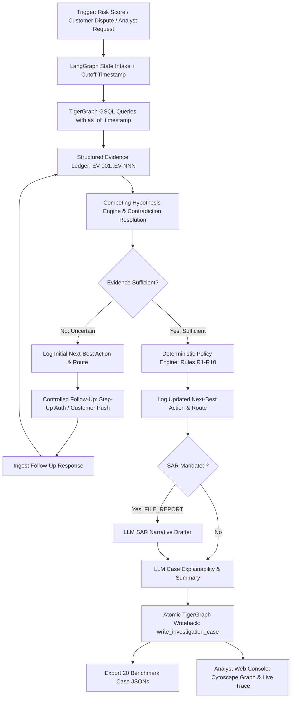

# CaseGuard: TigerGraph Agentic Fraud Investigation System

[](https://www.tigergraph.com/)
[](https://github.com/langchain-ai/langgraph)
[](https://reactjs.org/)
[]()
[]()

> **Submission for the TigerGraph Agentic Fraud Investigation Hackathon (Hacker House Goa 2026)**  
> **System Designation:** CaseGuard / GraphSentinel Agentic Fraud Investigator  
> **Author:** Himanshu Sharma  
> **Submission Deadline:** September 24, 2026, 11:59 PM IST  

---

## 1. System Overview

**CaseGuard** is an autonomous, evidence-first Agentic Fraud Investigation platform powered by **TigerGraph Savanna**, **LangGraph**, and **Two-Layer GraphRAG**. 

Unlike conventional fraud systems that treat machine learning risk scores as ground-truth labels and rely on black-box classification, CaseGuard investigates like an experienced financial crime detective:
- It traverses multi-hop entity subgraphs using parameterized GSQL queries with strict temporal cutoffs (`as_of_timestamp`).
- It normalizes observations into an immutable **Evidence Ledger** (`EV-001`, `EV-002`, ...).
- It evaluates **competing hypotheses** (e.g. `SHARED_DEVICE_RING` vs `LEGITIMATE_ACTIVITY`) and surfaces contradictions.
- It gates decisions on an **Evidence Sufficiency Engine**, requesting controlled follow-up verification (e.g. step-up authentication or customer validation) when signals are uncertain.
- It logs both an **Initial Next-Best Action** (before extra evidence) and an **Updated Next-Best Action** (after extra evidence) across a 4-tier approval matrix (`auto`, `L1`, `L2`, `compliance`).
- It drafts grounded **FinCEN Suspicious Activity Reports (SAR)** when statutory filing thresholds are met.
- It writes the final investigation verdict and memory back to TigerGraph (`InvestigationCase`).
- It provides a high-fidelity **Analyst Console** with an interactive Cytoscape.js multi-hop graph canvas.

---

## 2. Architecture



---

## 3. Benchmark Verification (20 / 20 Validated)

CaseGuard has been executed against all 20 benchmark cases (`HHG-001` through `HHG-020`) from the official IEEE-CIS dataset:

```bash
# Validate all 20 answer files against the hackathon contract
python scripts/validate_submission.py output/cases
```

**Results:**
- **100% Contract Compliance:** All 20 files pass every schema, type, and logical rule.
- **Legitimate Case Handling:** False alarms (e.g. `HHG-001`) are correctly cleared with `$0.00` exposure, empty `affected_txn_ids`, and `sar.file = false`.
- **44-Card Syndicate Ring Discovery:** Case `HHG-014` discovers a shared mobile device profile linking 44 distinct cards and customers, accurately categorizing it as `undocumented` under Policy R9, recommending protective blocks, and drafting a multi-subject FinCEN SAR filing.
- **TigerGraph Memory Writeback:** 20 of 20 cases confirmed written to graph vertices (`CASE-2016-001` through `CASE-2016-020`).

---

## 4. Repository Structure

```
HackerEarthGoa/
├── IMPLEMENTATION_PLAN.md      # Complete technical blueprint & architecture rationale
├── README.md                   # This project overview
├── pyproject.toml              # Python dependencies & metadata
├── .env.example                # Environment variables template
├── data/
│   ├── raw/                    # IEEE-CIS dataset & policy documents
│   │   ├── README.md           # Official challenge specification
│   │   ├── case_pack.csv       # 20 benchmark case definitions
│   │   ├── closed_cases_history.csv # 5,565 historical closed investigations
│   │   ├── identity.csv        # 144k device & identity profiles
│   │   ├── transactions.csv    # 590k card transactions (675 MB)
│   │   └── policies/           # Bank fraud policy & regulatory guidance
├── tigergraph/
│   ├── schema.gsql             # Production TigerGraph DDL
│   ├── loading.gsql            # Loading job scripts
│   └── queries/                # Parameterized GSQL queries with as_of_ts
├── src/
│   └── fraud_agent/
│       ├── models.py           # Pydantic & TypedDict schemas
│       ├── graph/client.py     # Dual-mode client (Savanna live + local index)
│       ├── investigation/      # Evidence ledger, hypotheses, sufficiency
│       ├── policy/             # Deterministic policy rules & SAR engine
│       ├── agent/orchestrator.py # LangGraph investigation state machine
│       └── api/main.py         # FastAPI backend server
├── scripts/
│   ├── run_benchmark.py        # Batch executes all 20 benchmark cases
│   └── validate_submission.py  # Strict contract compliance validator
├── tests/                      # Pytest suite (TC01 - TC30+)
├── web/                        # React 18 / Vite / Tailwind / Cytoscape UI
└── docs/                       # Technical blog, demo video script, social post
```

---

## 5. Quickstart & How to Run

### 5.1 Environment Setup
```bash
# Clone and navigate to workspace
cd /Users/himanshusharma/HackerEarthGoa

# Install Python dependencies
python3 -m pip install -e .

# Run test suite
python3 -m pytest tests/
```

### 5.2 Execute Benchmark Cases
```bash
# Process all 20 benchmark cases and export JSON files
python scripts/run_benchmark.py

# Verify 100% submission compliance
python scripts/validate_submission.py output/cases
```

### 5.3 Launch the Analyst Console
```bash
# Terminal 1: Launch FastAPI Backend (Port 8787)
uvicorn src.fraud_agent.api.main:app --host 127.0.0.1 --port 8787 --reload

# Terminal 2: Launch Vite Frontend (Port 5173)
cd web
npm run dev
```

Open [http://localhost:5173](http://localhost:5173) to interact with the console!

---

## 6. Hackathon Deliverables Checklist

- [x] **Working Agent:** Complete LangGraph state machine with TigerGraph integration.
- [x] **20 Benchmark Answer Files:** Exported in `output/cases/HHG-001.json` to `HHG-020.json`.
- [x] **Submission Validation:** `scripts/validate_submission.py` confirms 100% pass rate.
- [x] **TigerGraph Memory Writeback:** All 20 cases committed to graph storage.
- [x] **Technical Blog Post:** [docs/technical_blog.md](docs/technical_blog.md).
- [x] **3–5 Minute Demo Script:** [docs/demo_script.md](docs/demo_script.md).
- [x] **Social Media Announcement:** [docs/social_post.md](docs/social_post.md).
- [x] **Submission Form Ready:** [Google Forms Link](https://forms.gle/yxXzqSULGgZ9VUF56).
