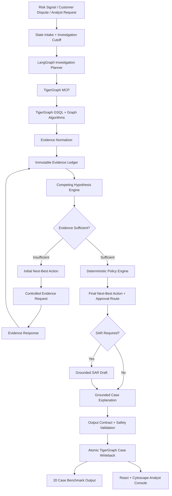
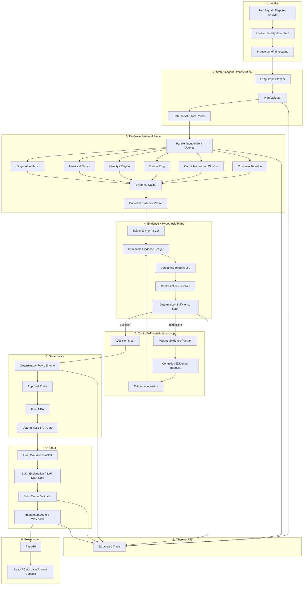

# CaseGuard / GraphSentinel — Builder AI Architecture Review & Hardening Specification

## 0. Purpose

This document is an **implementation instruction and architecture-review brief for Builder AI**.

Use it together with the existing CaseGuard system handbook and current repository. The goal is **not to redesign the product from scratch**. The goal is to:

1. inspect the existing implementation against the documented architecture;
2. identify architectural gaps, contradictions, weak coupling, bottlenecks, and unsafe assumptions;
3. preserve the evidence-first / agentic investigation philosophy;
4. make the system faster, more deterministic, more resilient, more auditable, and easier to demonstrate;
5. implement improvements only where they are justified by the existing architecture and benchmark requirements.

### Non-negotiable principle

> The LLM must never become the source of truth for fraud determination, policy, approval routing, temporal validity, or financial actions.

TigerGraph is the authoritative relationship/evidence layer. Deterministic application code owns policy, confidence/evidence gating, approval routing, validation, and state transitions. The LLM is used for planning within allowed tools, synthesis, explanations, and SAR narrative drafting.

---

# 1. Existing Architecture — Baseline To Preserve

The current architecture is:



## Current architectural strengths

The following concepts should remain intact:

- Stateful investigation rather than a single classification call.
- TigerGraph as the relationship/evidence source.
- `as_of_timestamp` temporal cutoff.
- Structured Evidence Ledger.
- Competing hypotheses rather than a single fraud label.
- Contradiction tracking.
- Evidence sufficiency gate.
- Controlled evidence-request loop.
- Initial and final Next-Best Actions.
- Deterministic policy and approval routing.
- Grounded SAR generation.
- Atomic investigation memory writeback.
- Machine-readable output contract.
- Analyst-facing graph + evidence trace.
- Benchmark validation and automated tests.

---

# 2. First Task — Audit Before Changing

Builder AI MUST inspect the current repository before implementing architectural changes.

Do not assume that the handbook describes the current code perfectly.

Create an internal audit covering:

### 2.1 Architecture-to-code mapping

For every major component, identify:

- actual file/module;
- public interfaces;
- input/output schema;
- dependencies;
- state ownership;
- synchronous vs asynchronous execution;
- external calls;
- error handling;
- tests;
- performance characteristics.

Required components:

- LangGraph state machine;
- TigerGraph client;
- MCP integration;
- GSQL queries;
- evidence normalizer;
- evidence ledger;
- hypothesis engine;
- sufficiency engine;
- policy engine;
- SAR engine;
- writeback;
- benchmark runner;
- submission validator;
- API;
- frontend;
- tests.

### 2.2 Detect handbook/code drift

Explicitly flag:

- components documented but not implemented;
- components implemented but undocumented;
- different field names;
- different action names;
- different verdict semantics;
- different TigerGraph schema;
- different temporal semantics;
- fake/mock implementations presented as production components;
- benchmark outputs that do not originate from the actual investigation engine;
- dead code;
- duplicated logic.

Do not silently reconcile contradictions. Record them first.

---

# 3. Target Architecture — Hardened Version

The target should preserve the current conceptual model while improving execution.



---

# 4. Priority Improvements

Implement improvements in the following order.

## P0 — Correctness and Safety

These are mandatory.

### P0.1 Immutable investigation cutoff

At case creation:

```text
investigation_cutoff_timestamp = case_trigger_timestamp
```

Do not allow downstream tools to independently mutate the cutoff.

Every temporal query must receive the same cutoff from state.

Reject:

- future observations;
- historical records after cutoff;
- tool responses without temporal metadata where temporal validity matters.

---

## P0.2 Strict typed investigation state

Define one canonical state schema.

Example:

```python
InvestigationState = {
    "case_id": str,
    "trigger_type": str,
    "trigger_transaction_id": str | None,
    "investigation_cutoff_timestamp": datetime,

    "plan": InvestigationPlan,
    "plan_version": int,

    "evidence_ids": list[str],
    "hypotheses": list[HypothesisState],
    "contradictions": list[Contradiction],

    "sufficiency_status": str,
    "missing_evidence": list[EvidenceRequest],

    "initial_nba": NBA | None,
    "final_nba": NBA | None,

    "approval_route": str | None,
    "sar_required": bool | None,

    "tool_trace": list[ToolTrace],
    "errors": list[InvestigationError],

    "status": str
}
```

Do not allow arbitrary dictionaries to mutate critical state without validation.

Use schema validation at state boundaries.

---

## P0.3 Idempotency

Every investigation and writeback operation must be safely retryable.

Use deterministic IDs:

```text
investigation_id = hash(case_id + cutoff_timestamp)
```

or another repository-consistent deterministic identifier.

Repeated execution must not create duplicate:

- InvestigationCase vertices;
- evidence IDs;
- memory edges;
- benchmark outputs.

---

## P0.4 Output contract validation

The final output must be validated before writeback.

Validation must verify:

- required fields;
- enum values;
- evidence references;
- entity existence;
- temporal validity;
- action/approval compatibility;
- SAR consistency;
- confidence bounds;
- exposure arithmetic;
- graph writeback ID;
- trace completeness.

If validation fails:

```text
DO NOT WRITE BACK
DO NOT PRESENT AS FINAL
RETURN STRUCTURED VALIDATION ERROR
```

---

# 5. Performance Architecture

The system should be optimized for **evidence retrieval latency**, not merely LLM latency.

## 5.1 Parallelize independent TigerGraph queries

Current conceptual sequence:

```text
baseline
 -> card window
 -> device ring
 -> history
 -> identity
```

Preferred:

```text
                 ┌─ baseline
                 ├─ card window
                 ├─ device ring
                 ├─ identity
Trigger ────────┼─ historical cases
                 └─ graph algorithms
                         |
                         v
                  Evidence Aggregator
```

Only serialize calls when one result is genuinely required to determine the next query.

### Expected benefit

Reduce total retrieval time from:

```text
T1 + T2 + T3 + T4 + T5
```

toward:

```text
max(T1, T2, T3, T4, T5)
```

plus aggregation overhead.

---

# 6. Evidence Retrieval Optimization

## 6.1 Bounded queries

Never retrieve an entire graph neighborhood when only a bounded subgraph is needed.

Every graph query should have:

- maximum hops;
- maximum vertices;
- maximum edges;
- time window;
- result limit;
- relevant attributes only.

Example:

```text
device_ring(
    device_id,
    max_hops=2,
    max_vertices=100,
    max_edges=250,
    as_of_timestamp=cutoff
)
```

---

## 6.2 Query result caching

Cache deterministic evidence queries using:

```text
cache_key =
    query_name
    + normalized_parameters
    + as_of_timestamp
    + schema_version
```

Important:

A cache hit must never bypass temporal validation.

Recommended TTL:

- case investigation cache: short-lived;
- immutable historical data: longer-lived;
- policy documents: version-based rather than time-based;
- customer follow-up responses: never blindly cache as reusable evidence.

---

# 7. Evidence Packet Design

Do not send raw TigerGraph dumps to the LLM.

Build a bounded packet:

```json
{
  "case": {...},
  "cutoff": "...",
  "evidence": [...],
  "hypotheses": [...],
  "contradictions": [...],
  "policy_context": [...],
  "allowed_actions": [...]
}
```

The LLM should receive only:

1. verified evidence;
2. evidence IDs;
3. bounded graph facts;
4. relevant historical cases;
5. relevant policy text;
6. current hypothesis state;
7. allowed actions.

This reduces:

- token usage;
- latency;
- hallucination surface;
- irrelevant context;
- reasoning drift.

---

# 8. Graph Algorithm Architecture

Graph algorithms must be treated as **evidence generators**, never verdict generators.

Correct:

```text
PageRank anomaly
      ↓
"Potentially unusual connectivity"
      ↓
Hypothesis evaluation
      ↓
Evidence sufficiency
```

Incorrect:

```text
PageRank high
      ↓
FRAUD
```

Same rule for:

- WCC;
- Louvain;
- PageRank;
- community density;
- degree anomalies.

Every algorithm result must include:

```text
algorithm
parameters
cutoff
entity
result
interpretation
```

---

# 9. Competing Hypothesis Engine

Maintain explicit hypothesis state:

```json
{
  "hypothesis_id": "HYP_SHARED_DEVICE_RING",
  "supporting_evidence": ["EV-001", "EV-008"],
  "contradicting_evidence": ["EV-012"],
  "status": "SUPPORTED",
  "score": 0.78
}
```

Do not allow a single evidence item to automatically become a final fraud verdict unless a deterministic policy rule explicitly says that evidence is sufficient.

The engine must preserve:

- supporting evidence;
- contradicting evidence;
- unresolved contradictions;
- missing evidence;
- hypothesis status.

---

# 10. Deterministic Sufficiency Gate

The LLM may explain uncertainty but must not decide whether evidence is sufficient.

Use deterministic rules.

Example:

```text
IF
    adverse_signal_count >= 2
AND independent_sources >= 2
AND severe_contradictions == 0
THEN
    SUFFICIENT
```

Alternative policy-specific sufficiency:

```text
IF policy_rule.required_evidence ⊆ verified_evidence
THEN SUFFICIENT
```

Otherwise:

```text
INSUFFICIENT
```

The exact thresholds must come from the existing project policy/rules. Do not invent new regulatory thresholds merely to make a case pass.

---

# 11. Investigation Loop Protection

The agent must never loop indefinitely.

Add:

```text
MAX_INVESTIGATION_STEPS
MAX_FOLLOWUP_REQUESTS
MAX_RETRIES_PER_TOOL
MAX_TOTAL_TOOL_LATENCY
```

Example state:

```json
{
  "step_count": 7,
  "followup_count": 1,
  "retry_count": 2
}
```

If the limit is reached:

```text
status = NEEDS_HUMAN_REVIEW
```

Never silently force a verdict.

---

# 12. Tool Governance

Create an explicit tool registry.

Example:

```text
ToolRegistry
├── tg_customer_baseline
├── tg_card_window
├── tg_device_ring
├── tg_identity_region
├── tg_similar_cases
├── tg_graph_algorithm
├── request_customer_confirmation
├── request_step_up_auth
├── write_investigation_case
└── retrieve_policy_context
```

Each tool should declare:

```json
{
  "name": "...",
  "purpose": "...",
  "risk_level": "READ_ONLY",
  "allowed_states": ["INVESTIGATING"],
  "required_inputs": [...],
  "output_schema": "...",
  "timeout_ms": 3000,
  "retry_policy": "..."
}
```

The planner can select from registered tools only.

The LLM must not generate arbitrary GSQL.

---

# 13. Reliability & Failure Handling

Every external call needs:

- timeout;
- retry policy;
- exponential backoff where appropriate;
- circuit-breaker behavior where appropriate;
- structured error;
- trace entry;
- safe fallback.

Never retry non-idempotent write operations blindly.

For example:

```text
READ query:
    retry = allowed

WRITE investigation:
    retry = idempotency-key required

Customer request:
    retry = avoid duplicate dispatch
```

---

# 14. Writeback Architecture

Treat writeback as a transaction boundary.

Preferred:

```text
Validate
   ↓
Build canonical Case Record
   ↓
Check idempotency
   ↓
Write InvestigationCase
   ↓
Write relationships
   ↓
Verify persistence
   ↓
Mark COMMITTED
```

Do not report:

```text
written_to_graph = true
```

until persistence has actually been verified.

If writeback fails:

```text
status = WRITEBACK_FAILED
written_to_graph = false
```

The benchmark result should make this visible.

---

# 15. Observability

Create a structured investigation trace.

Example:

```json
{
  "run_id": "RUN-001",
  "case_id": "HHG-001",
  "step": 4,
  "node": "device_ring",
  "tool": "tg_device_ring",
  "latency_ms": 143,
  "status": "SUCCESS",
  "input_hash": "...",
  "output_hash": "...",
  "evidence_ids_created": ["EV-009"],
  "error": null
}
```

Track at minimum:

### Latency
- total investigation latency;
- TigerGraph latency;
- LLM latency;
- policy latency;
- writeback latency.

### Agent behavior
- number of tool calls;
- duplicate tool calls;
- retries;
- unnecessary calls;
- loop count;
- evidence produced per call.

### Quality
- evidence citation coverage;
- unsupported claim count;
- temporal violation count;
- policy violation count;
- output validation failures.

---

# 16. LLM Optimization

Use the LLM only where it creates value.

Recommended flow:

```text
Deterministic Intake
      ↓
Deterministic Tool Eligibility
      ↓
Parallel Evidence Retrieval
      ↓
Deterministic Evidence Normalization
      ↓
Deterministic Hypothesis / Sufficiency
      ↓
LLM Synthesis
      ↓
Deterministic Output Validation
```

Avoid:

```text
LLM → query database → reason → query again → reason → policy → action
```

unless the next tool call genuinely depends on the previous evidence.

This reduces:

- latency;
- token cost;
- nondeterminism;
- tool-call loops.

---

# 17. Policy Separation

Separate:

```text
Evidence
Hypothesis
Policy
Decision
Explanation
```

Do not put policy thresholds inside LLM prompts as the only enforcement mechanism.

Recommended:

```text
PolicyRule
├── rule_id
├── description
├── required_evidence
├── forbidden_conditions
├── allowed_actions
├── approval_route
├── version
└── effective_from
```

Every final action should be explainable as:

```text
Action
← Policy Rule
← Evidence IDs
← Hypothesis
← Graph observations
```

---

# 18. SAR Architecture

Keep SAR generation downstream of the deterministic SAR gate.

Correct:

```text
Evidence
  ↓
Policy Engine
  ↓
SAR Required?
  ↓
YES
  ↓
LLM Draft
  ↓
SAR Validator
```

The LLM may draft prose but must not decide whether filing is legally required.

Every SAR narrative claim should map to evidence.

Add a validation pass for:

- subject identity;
- transaction dates;
- amounts;
- locations;
- entities;
- evidence references;
- no unsupported claims.

---

# 19. API Architecture

Keep the backend stateless where possible.

Suggested API boundaries:

```text
POST /api/investigations
GET  /api/investigations/{id}
GET  /api/investigations/{id}/evidence
GET  /api/investigations/{id}/trace
GET  /api/investigations/{id}/graph
GET  /api/investigations/{id}/actions
POST /api/investigations/{id}/approve
POST /api/investigations/{id}/followup
GET  /api/health
```

Do not make the frontend call TigerGraph directly.

Architecture:

```text
React
  ↓
FastAPI
  ↓
Investigation Service
  ↓
TigerGraph / Policy / Agent
```

---

# 20. Frontend Performance

The analyst console should not load the entire graph.

Use:

- lazy loading;
- bounded graph neighborhoods;
- pagination;
- virtualized evidence tables;
- server-side filtering;
- cached investigation summaries;
- progressive graph expansion.

Initial page should load:

```text
case summary
risk context
top evidence
current action
```

Then load:

```text
full graph
historical cases
full trace
```

on demand.

---

# 21. Benchmark Execution Improvements

The benchmark runner should use the same investigation engine as production/demo execution.

Avoid a separate shortcut implementation.

Correct:

```text
Benchmark Case
   ↓
Same Intake
   ↓
Same LangGraph
   ↓
Same Evidence Ledger
   ↓
Same Policy
   ↓
Same Writeback
   ↓
Output Contract
```

This prevents benchmark/demo divergence.

For 20 independent cases, process cases concurrently where TigerGraph capacity allows.

But preserve per-case ordering for:

```text
investigation state
evidence
writeback
trace
```

---

# 22. Testing Strategy

Expand the existing tests into layers.

## Unit tests

Test:

- evidence normalization;
- hypothesis scoring;
- contradiction handling;
- sufficiency;
- policy;
- SAR;
- output schema.

## Integration tests

Test:

- TigerGraph queries;
- MCP;
- LangGraph;
- writeback;
- API.

## Contract tests

Verify:

- tool input/output schemas;
- benchmark JSON schema;
- policy schema;
- state schema.

## Adversarial tests

Test:

- future timestamp;
- fake entity ID;
- missing evidence;
- contradictory evidence;
- malformed graph response;
- duplicate tool call;
- tool timeout;
- MCP failure;
- writeback failure;
- LLM unsupported claim;
- policy override attempt;
- infinite-loop attempt.

---

# 23. Acceptance Criteria

Builder AI should consider the architecture hardening complete only when:

### Correctness

- [ ] One immutable investigation cutoff exists per case.
- [ ] No future evidence enters reasoning.
- [ ] All evidence has provenance.
- [ ] Contradictions are preserved.
- [ ] LLM cannot directly set a financial action.
- [ ] LLM cannot override policy.
- [ ] LLM cannot generate arbitrary GSQL.
- [ ] Final output passes strict validation.

### Performance

- [ ] Independent graph retrieval calls execute concurrently.
- [ ] Query results are bounded.
- [ ] Deterministic evidence caching exists where safe.
- [ ] Duplicate calls are avoided.
- [ ] Full graph is never unnecessarily loaded.
- [ ] Frontend graph loading is lazy/bounded.

### Reliability

- [ ] Tool timeouts exist.
- [ ] Read retries exist where appropriate.
- [ ] Non-idempotent writes are protected.
- [ ] Investigation loops have hard limits.
- [ ] Failed writeback cannot be reported as success.
- [ ] Human review is a safe terminal state.

### Auditability

- [ ] Every tool call is traced.
- [ ] Every evidence item has provenance.
- [ ] Every action maps to policy + evidence.
- [ ] SAR claims are evidence-grounded.
- [ ] Writeback is verified.
- [ ] Benchmark outputs are reproducible.

---

# 24. Required Builder AI Workflow

Builder AI MUST work in this order:

```text
STEP 1
Inspect repository

        ↓

STEP 2
Map handbook architecture → actual code

        ↓

STEP 3
Produce architecture-gap report

        ↓

STEP 4
Identify P0/P1/P2 improvements

        ↓

STEP 5
Implement P0 correctness/safety fixes

        ↓

STEP 6
Implement performance improvements

        ↓

STEP 7
Implement observability and reliability

        ↓

STEP 8
Update tests

        ↓

STEP 9
Run benchmark

        ↓

STEP 10
Run submission validator

        ↓

STEP 11
Verify frontend/backend integration

        ↓

STEP 12
Generate final architecture report
```

Do not make large speculative rewrites before completing the repository audit.

---

# 25. Change Management Rules

For every modification, Builder AI should record:

```text
Change
Why
Current behavior
New behavior
Files changed
Risk
Test added
Performance impact
Backward compatibility
```

Avoid unnecessary dependency additions.

Avoid replacing working infrastructure unless the existing implementation is demonstrably inadequate.

Prefer:

```text
small deterministic improvement
```

over:

```text
large framework rewrite
```

---

# 26. Final Target Architecture Summary

The hardened CaseGuard architecture should behave as:

```text
                    ┌───────────────────────┐
                    │ Trigger / Analyst     │
                    └───────────┬───────────┘
                                ↓
                    ┌───────────────────────┐
                    │ Immutable Case State  │
                    │ + Temporal Cutoff     │
                    └───────────┬───────────┘
                                ↓
                    ┌───────────────────────┐
                    │ LangGraph Planner     │
                    │ + Tool Guard          │
                    └───────────┬───────────┘
                                ↓
               ┌─────────────────────────────────┐
               │ Parallel TigerGraph Retrieval   │
               │                                 │
               │ Baseline | Window | Device     │
               │ Identity | History | Algorithms │
               └────────────────┬────────────────┘
                                ↓
                    ┌───────────────────────┐
                    │ Evidence Normalizer   │
                    │ + Provenance          │
                    └───────────┬───────────┘
                                ↓
                    ┌───────────────────────┐
                    │ Immutable Evidence    │
                    │ Ledger                │
                    └───────────┬───────────┘
                                ↓
                    ┌───────────────────────┐
                    │ Hypotheses +          │
                    │ Contradictions        │
                    └───────────┬───────────┘
                                ↓
                    ┌───────────────────────┐
                    │ Sufficiency Gate      │
                    └───────┬───────┬───────┘
                            │       │
                   insufficient   sufficient
                            │       │
                            ↓       ↓
                    ┌──────────┐  ┌──────────────┐
                    │ Followup │  │ Policy Engine│
                    │ Evidence │  │ + Governance │
                    └────┬─────┘  └──────┬───────┘
                         │               ↓
                         └──────→  Final NBA
                                      ↓
                              Deterministic SAR
                                      ↓
                              Grounded LLM Draft
                                      ↓
                              Output Validator
                                      ↓
                              Idempotent Writeback
                                      ↓
                    ┌─────────────────────────────────┐
                    │ Trace + Benchmark + Analyst UI  │
                    └─────────────────────────────────┘
```

---

# 27. Most Important Engineering Principle

Do not optimize CaseGuard by making the LLM more powerful.

Optimize it by making the **system around the LLM more deterministic, parallel, bounded, typed, observable, and evidence-grounded**.

The desired progression is:

```text
Current:
Agent + Graph + Policy + UI

Target:
Agent
 + bounded parallel evidence retrieval
 + immutable temporal state
 + typed state machine
 + deterministic policy
 + contradiction-aware reasoning
 + controlled evidence loops
 + idempotent persistence
 + strict output validation
 + full observability
 + benchmark/production parity
```

That is the architecture Builder AI should implement against.
