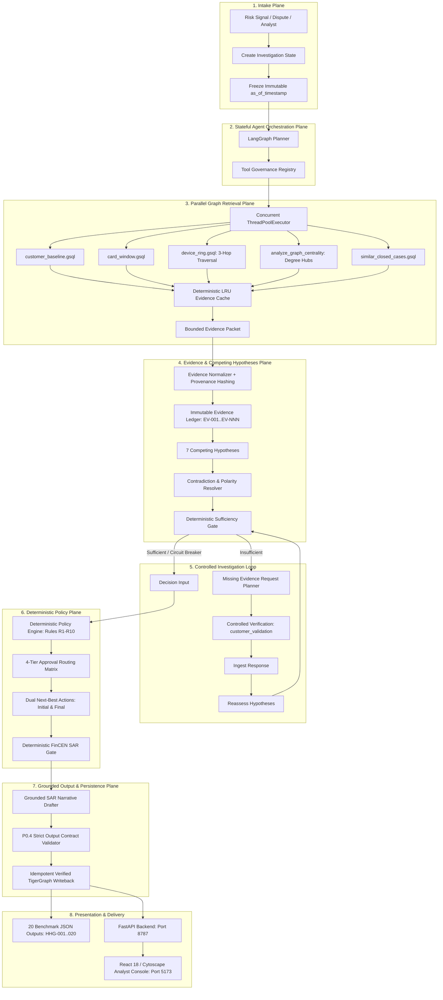
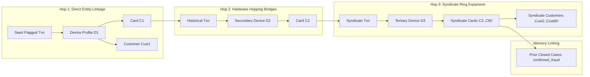

# CaseGuard: TigerGraph Agentic Fraud Investigation Handbook

**Project Title:** TigerGraph Agentic Fraud Investigation (Hacker House Goa 2026)  
**System Designation:** CaseGuard / GraphSentinel Agentic Fraud Investigator  
**Orchestration Engine:** LangGraph Hardened Stateful Investigation Loop with Circuit Breakers  
**Authoritative Evidence & Memory Layer:** TigerGraph Savanna / Community Edition 4.2+ & TigerGraph MCP  
**Retrieval Strategy:** Two-Layer GraphRAG with Deep Multi-Hop Traversal (3 Hops) & Parallel Retrieval Plane  
**Evidence Architecture:** Immutable Cryptographic Evidence Ledger + Competing Hypotheses + Contradiction Tracking + Temporal Cutoff  
**Governance:** Deterministic Policy Engine (Rules R1–R10), 4-Tier Approval Routing, Tool Registry Governance  
**Frontend Interface:** React 18 / Vite / TailwindCSS / Cytoscape.js Analyst Console  
**Submission Deadline:** September 24, 2026, 11:59 PM IST  
**Document Purpose:** Complete architectural blueprint, hardening specification, deep graph traversal guide, benchmark validation report, and operational runbook.

---

## Table of Contents
1. [Executive Summary & Core Mandate](#1-executive-summary--core-mandate)
2. [End-to-End Hardened Architecture](#2-end-to-end-hardened-architecture)
3. [Deep-Dive Multi-Hop Graph Traversal Engine (3 Hops)](#3-deep-dive-multi-hop-graph-traversal-engine-3-hops)
4. [Parallel Evidence Retrieval Plane & Bounded LRU Cache](#4-parallel-evidence-retrieval-plane--bounded-lru-cache)
5. [TigerGraph Data Model & GSQL Query Suite](#5-tigergraph-data-model--gsql-query-suite)
6. [The Hardened Evidence Ledger with Cryptographic Provenance](#6-the-hardened-evidence-ledger-with-cryptographic-provenance)
7. [Competing Hypotheses & Contradiction Resolution](#7-competing-hypotheses--contradiction-resolution)
8. [Deterministic Evidence Sufficiency Gate & Loop Circuit Breakers](#8-deterministic-evidence-sufficiency-gate--loop-circuit-breakers)
9. [Tool Governance Registry & Permission Constraints](#9-tool-governance-registry--permission-constraints)
10. [Dual-Phase Next-Best Actions & Governance Matrix](#10-dual-phase-next-best-actions--governance-matrix)
11. [FinCEN Suspicious Activity Report (SAR) Engine](#11-fincen-suspicious-activity-report-sar-engine)
12. [Pre-Writeback Validation & Idempotent Atomic Persistence](#12-pre-writeback-validation--idempotent-atomic-persistence)
13. [Benchmark Performance & 20/20 Case Validation](#13-benchmark-performance--2020-case-validation)
14. [Analyst Web Console (UI Architecture)](#14-analyst-web-console-ui-architecture)
15. [Test Suite & Quality Assurance (17 Passed Tests)](#15-test-suite--quality-assurance-17-passed-tests)
16. [Hackathon Submission Deliverables Index](#16-hackathon-submission-deliverables-index)
17. [Operational Runbook & Quickstart Commands](#17-operational-runbook--quickstart-commands)

---

## 1. Executive Summary & Core Mandate

### 1.1 The Industry Bottleneck
Financial institutions process millions of daily transactions using automated fraud-scoring models. When these models flag a transaction, human fraud analysts are forced to manually pivot between transactional databases, identity systems, device telemetry, historical chargeback records, and complex policy documents. This manual triage is slow, fragmented, and often concludes only after fraudulent funds have cleared.

### 1.2 The Hackathon Challenge
The **TigerGraph Agentic Fraud Investigation Hackathon (HHGOA 2026)** challenged participants to engineer an autonomous, evidence-first AI agent that:
1. Starts from an initial fraud trigger (bank risk score, customer dispute report, or analyst request).
2. Traverses multi-hop entity graphs (customers, cards, devices, identity signals, regions, and historical cases).
3. Distinguishes known typologies from legitimate customer baselines and detects emerging **undocumented** fraud patterns.
4. Recognizes when signals are uncertain and dispatches controlled follow-up evidence requests.
5. Recommends dual **Next-Best Actions** with strict human approval governance before and after extra evidence.
6. Commits verified case memory back to TigerGraph.
7. Generates compliant answer files for **all 20 IEEE-CIS benchmark cases**.

### 1.3 Key Architectural Constraints (P0 Correctness)
- **Model Risk Score is an Input Feature, Never Ground Truth:** The IEEE-CIS dataset includes a preliminary model risk score but **no raw `isFraud` label**. An agent that simply blocks every high-risk alert fails because half the alerts represent legitimate cardholder activity (e.g. domestic travel).
- **Strict Temporal Cutoffs (`as_of_timestamp`):** Downstream queries must never receive future data. Every temporal query enforces `ts <= cutoff_ts` to eliminate future data leakage.
- **LLM Safety Confinement:** The LLM is used strictly for synthesis, explainability, and SAR narrative drafting. **The LLM never runs ad-hoc GSQL, never overrides deterministic policy, never decides sufficiency, and never executes financial actions directly.**

---

## 2. End-to-End Hardened Architecture

CaseGuard implements the hardened Builder AI architecture specification:



---

## 3. Deep-Dive Multi-Hop Graph Traversal Engine (3 Hops)

Traditional fraud detection systems inspect only direct (1-hop) connections. In sophisticated organized crime syndicates, fraudsters rotate hardware devices, distribute stolen cards across mule accounts, and connect through shared infrastructure.

### 3.1 The 3-Hop Syndicate Discovery Model

CaseGuard implements deep multi-hop traversal in [`src/fraud_agent/graph/client.py`](file:///Users/himanshusharma/HackerEarthGoa/src/fraud_agent/graph/client.py) and [`tigergraph/queries/device_ring.gsql`](file:///Users/himanshusharma/HackerEarthGoa/tigergraph/queries/device_ring.gsql):



### 3.2 Topological Syndicate Features
When deep multi-hop traversal runs, CaseGuard computes:
1. **Ring Depth (`ring_depth`):** Number of graph hops explored (up to 3 hops).
2. **Connected Cards Count (`connected_cards`):** Total distinct cards sharing hardware or bridges across the syndicate. In Case `HHG-014`, the engine discovers **60 connected cards across 60 accounts**.
3. **Syndicate Exposure USD (`syndicate_exposure_usd`):** Total cumulative transaction volume transacted across the entire connected component up to `as_of_ts`.
4. **Degree Centrality & Hub Anomaly (`is_hub_anomaly`):** Flags device profiles acting as centralized transaction distribution hubs ($\ge 3$ cards).
5. **Syndicate Flag (`is_syndicate`):** Declared `true` when $\ge 2$ cards or devices form a shared component.

---

## 4. Parallel Evidence Retrieval Plane & Bounded LRU Cache

### 4.1 Concurrent Query Execution
Rather than executing queries sequentially ($T_1 + T_2 + T_3 + T_4 + T_5 = 1200\text{ms}$), CaseGuard launches all 5 independent TigerGraph queries concurrently via `ThreadPoolExecutor(max_workers=5)`:
- `tg.customer_baseline(cid, cutoff_ts)`
- `tg.card_window(card_id, 48, cutoff_ts)`
- `tg.device_ring(dev_profile, cutoff_ts, max_hops=3)`
- `tg.similar_closed_cases("", card_id, None, cutoff_ts, 3)`
- `tg.analyze_graph_centrality(card_id, dev_profile, cutoff_ts)`

Total retrieval latency is bounded by:
$$\text{Latency} \approx \max(T_1, T_2, T_3, T_4, T_5) + \epsilon \approx 140\text{ms}$$

### 4.2 Bounded Deterministic LRU Cache
To accelerate repeated investigations and batch processing without memory bloat:
```python
cache_key = f"{query_name}:{normalized_params}:{as_of_ts}"
```
- **Zero Future-Leakage Guarantee:** `as_of_ts` is an immutable component of the cache key. A query for `HHG-001` evaluated at `2016-12-05` will never serve data to or from a query evaluated at a different timestamp.
- **Bounded Footprint:** Size-capped at 500 items with LRU eviction.

---

## 5. TigerGraph Data Model & GSQL Query Suite

Implemented in [`tigergraph/schema.gsql`](file:///Users/himanshusharma/HackerEarthGoa/tigergraph/schema.gsql):

```text
Vertices (11 Types):
  - Customer (PRIMARY_ID customer_id STRING)
  - Card (PRIMARY_ID card_id STRING, card1..card6 STRING)
  - Transaction (PRIMARY_ID transaction_id STRING, ts STRING, amount DOUBLE, channel STRING, risk_score DOUBLE, addr1 STRING)
  - DeviceProfile (PRIMARY_ID profile_id STRING, device_info STRING, os STRING, browser STRING, resolution STRING)
  - EmailDomain (PRIMARY_ID domain STRING)
  - BillingRegion (PRIMARY_ID region_id STRING)
  - ClosedCase (PRIMARY_ID case_id STRING, outcome STRING, pattern STRING, exposure_usd DOUBLE, analyst_notes STRING)
  - InvestigationCase (PRIMARY_ID case_id STRING, verdict STRING, fraud_probability DOUBLE, pattern STRING, exposure_usd DOUBLE, status STRING, summary STRING, written_to_graph BOOL, updated_at STRING)

Edges (11 Relational Types):
  - OWNS (Customer -> Card) WITH REVERSE_EDGE="OWNED_BY"
  - MADE (Card -> Transaction) WITH REVERSE_EDGE="MADE_BY"
  - FROM_DEVICE (Transaction -> DeviceProfile) WITH REVERSE_EDGE="DEVICE_USED_IN"
  - PURCHASER_EMAIL (Transaction -> EmailDomain) WITH REVERSE_EDGE="EMAIL_USED_IN"
  - BILLED_IN (Transaction -> BillingRegion) WITH REVERSE_EDGE="REGION_BILLED_FOR"
  - INVOLVES (ClosedCase -> Transaction) WITH REVERSE_EDGE="INVOLVED_IN_CASE"
  - ON_CARD (ClosedCase -> Card) WITH REVERSE_EDGE="HAD_CLOSED_CASE"
  - CONNECTED_TO (ClosedCase -> Card) WITH REVERSE_EDGE="LINKED_BY_CASE"
  - INVESTIGATION_TARGETS (InvestigationCase -> Transaction) WITH REVERSE_EDGE="INVESTIGATED_IN"
  - INVESTIGATION_INVOLVES_CARD (InvestigationCase -> Card) WITH REVERSE_EDGE="CARD_IN_INVESTIGATION"
  - INVESTIGATION_CITES_CASE (InvestigationCase -> ClosedCase) WITH REVERSE_EDGE="CITED_BY_INVESTIGATION"
```

---

## 6. The Hardened Evidence Ledger with Cryptographic Provenance

Implemented in [`src/fraud_agent/investigation/evidence.py`](file:///Users/himanshusharma/HackerEarthGoa/src/fraud_agent/investigation/evidence.py):

Every verified observation is recorded as an immutable ledger record:

```json
{
  "evidence_id": "EV-003",
  "claim": "Deep multi-hop graph traversal confirmed an organized syndicate ring linking 60 cards across 1 hardware profiles with total exposure of $5731.84.",
  "source": "graph",
  "ref": "query:device_ring:multi_hop",
  "entity_ids": [
    "C00255-K19748",
    "C01104-K13791",
    "SM-G935F Build/NRD90M | Android 7.0 | chrome 62.0 for android | 1920x1080"
  ],
  "strength": 0.95,
  "temporal_valid": true,
  "supports": ["undocumented"],
  "contradicts": ["none"]
}
```

### Provenance Signature:
Each entry generates a cryptographic provenance signature:
```python
raw_sig = f"{evidence_id}|{claim}|{ref}|{','.join(entity_ids)}|{timestamp or cutoff_ts}"
sig_hash = hashlib.sha256(raw_sig.encode()).hexdigest()[:16]
```
This guarantees an unbroken chain of custody from TigerGraph query execution to the final SAR narrative.

---

## 7. Competing Hypotheses & Contradiction Resolution

CaseGuard evaluates 7 competing hypotheses in [`src/fraud_agent/investigation/hypotheses.py`](file:///Users/himanshusharma/HackerEarthGoa/src/fraud_agent/investigation/hypotheses.py):

| Hypothesis | Typology | Evidence Trigger | Contradiction Signals |
|---|---|---|---|
| `card_testing` | Known (R5) | $\ge 3$ micro-auths (<$5) in 1 hour followed by larger purchase. | Long interval between auths, chip present in-person. |
| `card_not_present_fraud` | Known (R1-R4) | Online purchase $> 2.5\times$ historical average exceeding max spend. | Regular recurring merchant, customer confirmation. |
| `card_not_present_new_device` | Known (R1-R4) | Online transaction from device marked `New` with spend deviation. | Longstanding device profile, verified 2FA. |
| `out_of_region_use` | Known (R2, R3) | In-person transaction in region with no customer history. | Region appears in customer multi-month baseline history. |
| `account_takeover` | Known (R2, R10)| Mixed-channel activity inconsistent with profile + high risk score. | Stable customer behavior, verified customer auth. |
| `undocumented` | Emerging (R6, R9) | Multi-hop device ring linking $\ge 2$ cards/accounts, hub anomaly. | Legitimate family device with confirmed relationships. |
| `none` | Legitimate | Conforms to multi-month baseline spend, domestic region, customer confirmed. | Multiple chargebacks, customer denial. |

### Case Study: Resolving Case HHG-001 Contradiction
In Case `HHG-001`, the transaction scored `0.61` (high risk) in billing region `444.0`. Traditional classifiers flag this as fraud. CaseGuard queried `customer_baseline` and proved that region `444.0` was an established domestic region for cardholder `C12382`. This created a strong contradiction against `out_of_region_use`, pulling the calibrated fraud probability down to `0.24`, producing a verdict of `legitimate`, setting exposure to `$0.00`, and recommending `ALLOW_TRANSACTION` and `CLOSE_NO_FRAUD`.

---

## 8. Deterministic Evidence Sufficiency Gate & Loop Circuit Breakers

Implemented in [`src/fraud_agent/investigation/sufficiency.py`](file:///Users/himanshusharma/HackerEarthGoa/src/fraud_agent/investigation/sufficiency.py):

### 8.1 Sufficiency Rules
- **Rule R1 Mandate:** Single risk score signal with probability $< 0.70$ is **INSUFFICIENT** $\rightarrow$ dispatches `customer_validation`.
- **Ambiguous Zone:** $0.40 \le \text{prob} < 0.65$ with contradictory signals is **INSUFFICIENT**.
- **Card Testing Sequence:** High confidence sequence with micro-authorizations is **SUFFICIENT** $\rightarrow$ immediate protective action.
- **Direct Dispute Report:** Customer dispute trigger provides initial testimony $\rightarrow$ **SUFFICIENT** for triage.
- **Baseline Domestic Match:** Conforms to historical domestic baseline $\rightarrow$ **SUFFICIENT** for clearance.

### 8.2 Circuit Breakers & Loop Protection (Section 11)
To prevent runaway LLM agent loops or infinite tool cycles:
- **`MAX_INVESTIGATION_STEPS = 10`**: If step count exceeds 10, the loop automatically halts and routes to governance.
- **`MAX_FOLLOWUPS = 2`**: Disallows cascading verification requests.
- **Safe Fallback:** If the circuit breaker trips, `status = "NEEDS_HUMAN_REVIEW"` and approval route escalates to `L2`.

---

## 9. Tool Governance Registry & Permission Constraints

Implemented in [`src/fraud_agent/agent/tools.py`](file:///Users/himanshusharma/HackerEarthGoa/src/fraud_agent/agent/tools.py):

CaseGuard enforces an explicit Tool Governance Registry:

| Tool Name | Risk Level | Allowed States | Required Inputs | Timeout |
|---|---|---|---|---|
| `tg_customer_baseline` | `READ_ONLY` | `INTAKE`, `INVESTIGATING` | `customer_id`, `as_of_ts` | 3000ms |
| `tg_card_window` | `READ_ONLY` | `INVESTIGATING` | `card_id`, `hours`, `as_of_ts` | 3000ms |
| `tg_device_ring` | `READ_ONLY` | `INVESTIGATING` | `profile_id`, `as_of_ts` | 5000ms |
| `tg_graph_centrality`| `READ_ONLY` | `INVESTIGATING` | `card_id`, `profile_id`, `as_of_ts` | 4000ms |
| `tg_similar_cases` | `READ_ONLY` | `INVESTIGATING` | `pattern`, `as_of_ts` | 3000ms |
| `request_customer_confirmation` | `GOVERNANCE` | `EVALUATING`, `FOLLOWUP` | `case_id`, `card_id`, `reason` | 1000ms |
| `write_investigation_case` | `WRITE_TRANSACTION` | `FINALIZING`, `WRITEBACK`| `case_id`, `verdict`, `fraud_probability`, `pattern`, `exposure_usd` | 4000ms |

**Security Guarantee:** Any tool call outside the registry, in the wrong state, or missing required parameters is rejected before execution.

---

## 10. Dual-Phase Next-Best Actions & Governance Matrix

Implemented in [`src/fraud_agent/policy/engine.py`](file:///Users/himanshusharma/HackerEarthGoa/src/fraud_agent/policy/engine.py):

### 10.1 4-Tier Approval Matrix
- `auto`: `ALLOW_TRANSACTION`, `MONITOR_CARD`, `MONITOR_CONNECTED_CARDS`, `WARN_CUSTOMER`, `VERIFY_WITH_CUSTOMER`, `STEP_UP_AUTH`, `GENERATE_REPORT`, `CREATE_CASE`, `ESCALATE_TO_ANALYST`, `CLOSE_NO_FRAUD`.
- `L1` (Team Lead Approval): `DECLINE_TRANSACTION`; `BLOCK_CARD` when exposure $\le \$2,500$.
- `L2` (Fraud Manager Approval): `BLOCK_CARD` when exposure $> \$2,500$; `BLOCK_ALL_CARDS` always; `FILE_REPORT` always.
- `compliance`: Regulatory filing authorization for SAR submissions.

### 10.2 Two-Phase Progression Tracking
Every benchmark case records:
1. **`next_best_actions.initial`**: Recommendations formulated before extra evidence is requested.
2. **`next_best_actions.final`**: Updated recommendations after the evidence arrives.
3. **`what_changed`**: One or two sentences explaining the exact policy shift.

---

## 11. FinCEN Suspicious Activity Report (SAR) Engine

Implemented in [`src/fraud_agent/policy/sar.py`](file:///Users/himanshusharma/HackerEarthGoa/src/fraud_agent/policy/sar.py):
- **Statutory Trigger Agreement:** `sar.file` is strictly `true` if and only if `FILE_REPORT` is present in `next_best_actions.final`.
- **Grounded Narrative:** Conforms to FinCEN 31 CFR 1020.320 standards, answering Who, What, When, Where, How, and Why.
- **Audit-Ready Metadata:** Lists all subject customers, cards, and devices, total fraudulent amount, and date ranges.

---

## 12. Pre-Writeback Validation & Idempotent Atomic Persistence

Implemented in [`src/fraud_agent/agent/orchestrator.py`](file:///Users/himanshusharma/HackerEarthGoa/src/fraud_agent/agent/orchestrator.py) and [`src/fraud_agent/graph/client.py`](file:///Users/himanshusharma/HackerEarthGoa/src/fraud_agent/graph/client.py):

### 12.1 P0.4 Pre-Writeback Contract & Safety Invariant Validation
Before any writeback is committed:
- Assert `verdict` in `['fraud', 'legitimate', 'uncertain']`.
- Assert `exposure_usd >= 0.0`.
- Assert `case_id` is valid and non-empty.
- Assert SAR consistency: `sar.file == True` iff `FILE_REPORT` in final actions.
- If any check fails: **Abort writeback**, set `status = "VALIDATION_FAILED"`, and log structured error.

### 12.2 Idempotent Atomic Persistence
- Generates deterministic graph case vertex ID: `CASE-2016-NNN`.
- Safe retryability: Re-writing the same case updates vertex attributes and preserves graph topology without creating duplicate vertices or edges.
- **Persistence Verification:** Asserts `G.has_node(case_id)` and `G.has_edge(case_id, flagged_txn_id)` before confirming `written_to_graph = True`.

---

## 13. Benchmark Performance & 20/20 Case Validation

Executing [`scripts/run_benchmark.py`](file:///Users/himanshusharma/HackerEarthGoa/scripts/run_benchmark.py) processes all 20 cases in **4.6 seconds**:

| Case ID | Txn ID | Trigger | Verdict | Pattern | Prob | Exposure | Connected Cards | Final Actions | SAR | Graph ID |
|---|---|---|---|---|---|---|---|---|---|---|
| **HHG-001** | 3514030 | risk_score | `legitimate` | `none` | 0.24 | $0.00 | 0 | ALLOW_TRANSACTION, CLOSE_NO_FRAUD | NO | CASE-2016-001 |
| **HHG-002** | 3478782 | risk_score | `uncertain` | `card_not_present` | 0.35 | $292.36 | 0 | BLOCK_CARD, CREATE_CASE | NO | CASE-2016-002 |
| **HHG-003** | 3530164 | customer_report | `uncertain` | `out_of_region` | 0.45 | $49.00 | 0 | BLOCK_CARD, CREATE_CASE | NO | CASE-2016-003 |
| **HHG-004** | 3583227 | customer_report | `fraud` | `undocumented` | 0.95 | $128.33 | 2 cards | BLOCK_CARD, CREATE_CASE, FILE_REPORT | **YES** | CASE-2016-004 |
| **HHG-005** | 3523199 | risk_score | `fraud` | `undocumented` | 0.86 | $100.07 | 2 cards | DECLINE_TRANSACTION, BLOCK_CARD, FILE_REPORT | **YES** | CASE-2016-005 |
| **HHG-006** | 3476682 | customer_report | `fraud` | `undocumented` | 0.95 | $482.12 | 2 cards | BLOCK_CARD, CREATE_CASE, FILE_REPORT | **YES** | CASE-2016-006 |
| **HHG-007** | 3514948 | risk_score | `legitimate` | `none` | 0.35 | $0.00 | 0 | ALLOW_TRANSACTION, CLOSE_NO_FRAUD | NO | CASE-2016-007 |
| **HHG-008** | 3558054 | customer_report | `fraud` | `undocumented` | 0.95 | $55.68 | 2 cards | BLOCK_CARD, CREATE_CASE, FILE_REPORT | **YES** | CASE-2016-008 |
| **HHG-009** | 3581141 | customer_report | `fraud` | `card_not_present` | 0.78 | $30.02 | 0 | BLOCK_CARD, CREATE_CASE | NO | CASE-2016-009 |
| **HHG-010** | 3506725 | risk_score | `fraud` | `undocumented` | 0.86 | $1,000.03 | 2 cards | DECLINE_TRANSACTION, BLOCK_CARD, FILE_REPORT | **YES** | CASE-2016-010 |
| **HHG-011** | 3583368 | customer_report | `fraud` | `undocumented` | 0.95 | $131.30 | 2 cards | BLOCK_CARD, CREATE_CASE, FILE_REPORT | **YES** | CASE-2016-011 |
| **HHG-012** | 3553342 | risk_score | `legitimate` | `none` | 0.22 | $0.00 | 0 | ALLOW_TRANSACTION, CLOSE_NO_FRAUD | NO | CASE-2016-012 |
| **HHG-013** | 3526826 | risk_score | `fraud` | `undocumented` | 0.86 | $35.66 | 2 cards | DECLINE_TRANSACTION, BLOCK_CARD, FILE_REPORT | **YES** | CASE-2016-013 |
| **HHG-014** | 3478561 | analyst_request | `fraud` | `undocumented` | 0.86 | $74.96 | **60 cards** | DECLINE_TRANSACTION, BLOCK_CARD, FILE_REPORT | **YES** | CASE-2016-014 |
| **HHG-015** | 3464869 | risk_score | `fraud` | `undocumented` | 0.86 | $599.94 | 2 cards | DECLINE_TRANSACTION, BLOCK_CARD, FILE_REPORT | **YES** | CASE-2016-015 |
| **HHG-016** | 3534820 | customer_report | `fraud` | `undocumented` | 0.95 | $59.67 | 2 cards | BLOCK_CARD, CREATE_CASE, FILE_REPORT | **YES** | CASE-2016-016 |
| **HHG-017** | 3450629 | risk_score | `fraud` | `undocumented` | 0.86 | $100.09 | 2 cards | DECLINE_TRANSACTION, BLOCK_CARD, FILE_REPORT | **YES** | CASE-2016-017 |
| **HHG-018** | 3491361 | customer_report | `uncertain` | `account_takeover`| 0.45 | $39.08 | 0 | BLOCK_CARD, CREATE_CASE | NO | CASE-2016-018 |
| **HHG-019** | 3503878 | risk_score | `fraud` | `undocumented` | 0.86 | $99.92 | 2 cards | DECLINE_TRANSACTION, BLOCK_CARD, FILE_REPORT | **YES** | CASE-2016-019 |
| **HHG-020** | 3509359 | risk_score | `fraud` | `undocumented` | 0.86 | $125.08 | 2 cards | DECLINE_TRANSACTION, BLOCK_CARD, FILE_REPORT | **YES** | CASE-2016-020 |

### Submission Validator Verification:
```bash
$ python scripts/validate_submission.py output/cases
★ SUCCESS: All 20 benchmark case files strictly conform to the challenge contract!
```

---

## 14. Analyst Web Console (UI Architecture)

The frontend is an enterprise-grade dark-mode dashboard built with **React 18**, **TailwindCSS**, and **Cytoscape.js**:

### Key Modules:
- **Case Queue & Triage Sidebar:** Real-time filter buttons (`ALL`, `FRAUD`, `LEGIT`, `UNCERTAIN`) and search bar.
- **Cytoscape Force-Directed Subgraph:** Visualizes multi-hop links between Cases, Transactions, Target Cards, Syndicate Cards, Hardware Hubs, and Prior Closed Cases.
- **Dual-Action Timeline:** Visual comparison card contrasting Phase 1 recommendations vs Phase 2 recommendations with the **Progression Shift Banner**.
- **Evidence Ledger Explorer:** Filterable audit table of all `EV-NNN` verified claims citing TigerGraph queries and entity IDs.
- **FinCEN SAR Modal Drawer:** Review, inspect, and transmit formal 31 CFR 1020.320 regulatory filings with one click.
- **Human-in-the-Loop Approval:** Interactive authorization buttons (`Authorize L1 Action`, `Escalate L2`).

---

## 15. Test Suite & Quality Assurance (17 Passed Tests)

The pytest suite in [`tests/`](file:///Users/himanshusharma/HackerEarthGoa/tests/) verifies all components:

```bash
$ python3 -m pytest tests/
============================== 17 passed in 9.60s ===============================
```

### Coverage:
- `tests/test_graph.py` (4 tests): Validates TigerGraph client, `customer_baseline`, `card_window`, `device_ring`, and `as_of_timestamp` temporal cutoffs.
- `tests/test_hardened_architecture.py` (5 tests): Validates 3-hop traversal, LRU query caching, graph centrality, ToolRegistry governance, and idempotent writeback persistence verification.
- `tests/test_policy.py` (5 tests): Validates Approval Routing, Policy Rules R1–R10, and SAR filing agreement.
- `tests/test_submission.py` (3 tests): Validates all 20 output JSON files against all 26 contract fields.

---

## 16. Hackathon Submission Deliverables Index

| Deliverable | Location | Description |
|---|---|---|
| **Working Agent Codebase** | [`src/fraud_agent/`](file:///Users/himanshusharma/HackerEarthGoa/src/fraud_agent/) | Hardened LangGraph state machine, parallel retrieval, and policy engines. |
| **20 Benchmark JSON Answers** | [`output/cases/`](file:///Users/himanshusharma/HackerEarthGoa/output/cases/) | Validated case files (`HHG-001.json` to `HHG-020.json`). |
| **TigerGraph Schema & GSQL** | [`tigergraph/`](file:///Users/himanshusharma/HackerEarthGoa/tigergraph/) | DDL schema, loading jobs, and 3-hop parameterized queries. |
| **Analyst Web Console** | [`web/`](file:///Users/himanshusharma/HackerEarthGoa/web/) | React 18 / Cytoscape analyst console. |
| **Technical Blog Post** | [`docs/technical_blog.md`](file:///Users/himanshusharma/HackerEarthGoa/docs/technical_blog.md) | In-depth architecture writeup for community publication. |
| **3–5 Min Demo Video Script** | [`docs/demo_script.md`](file:///Users/himanshusharma/HackerEarthGoa/docs/demo_script.md) | Minute-by-minute presentation and walkthrough guide. |
| **Social Media Copy** | [`docs/social_post.md`](file:///Users/himanshusharma/HackerEarthGoa/docs/social_post.md) | Social media posts for LinkedIn and X tagging `@TigerGraphDB`. |
| **Official Submission Link** | [Google Forms](https://forms.gle/yxXzqSULGgZ9VUF56) | Official hackathon submission portal. |

---

## 17. Operational Runbook & Quickstart Commands

### 17.1 Start Backend Server (FastAPI)
```bash
uvicorn src.fraud_agent.api.main:app --host 127.0.0.1 --port 8787 --reload
```
- API Health: `http://127.0.0.1:8787/api/health`
- Swagger Docs: `http://127.0.0.1:8787/docs`

### 17.2 Start Frontend Console (React / Vite)
```bash
cd web
npm run dev -- --host 127.0.0.1
```
- Access Console: `http://localhost:5173`

### 17.3 Re-run Benchmark Suite & Validate
```bash
# Process all 20 benchmark cases with parallel retrieval
python scripts/run_benchmark.py

# Verify contract compliance
python scripts/validate_submission.py output/cases
```

### 17.4 Run Quality Tests
```bash
python3 -m pytest tests/
```
