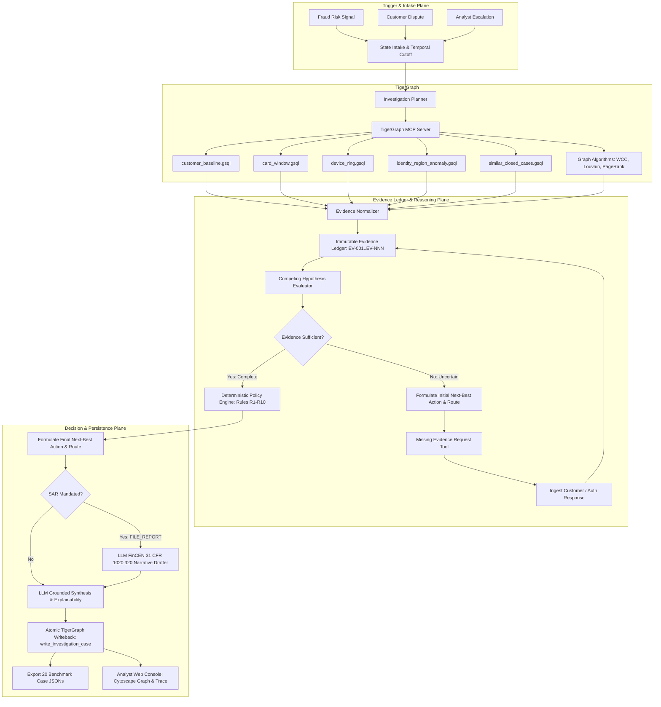
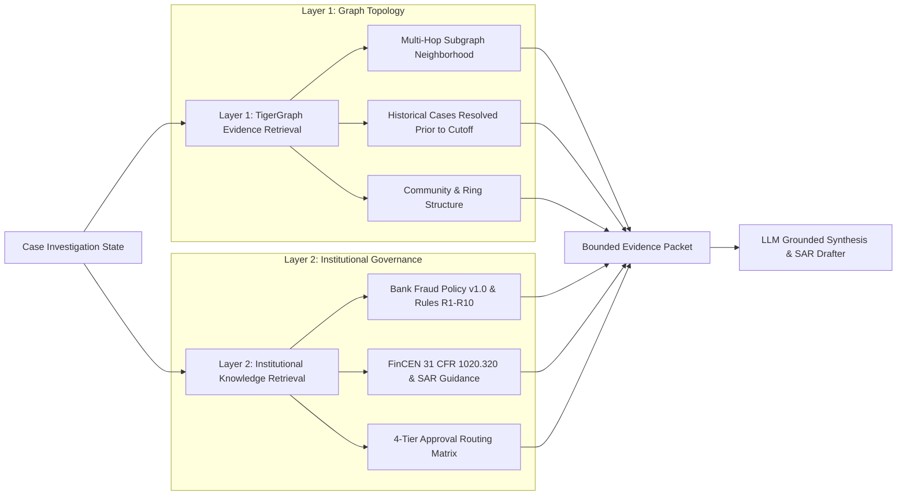
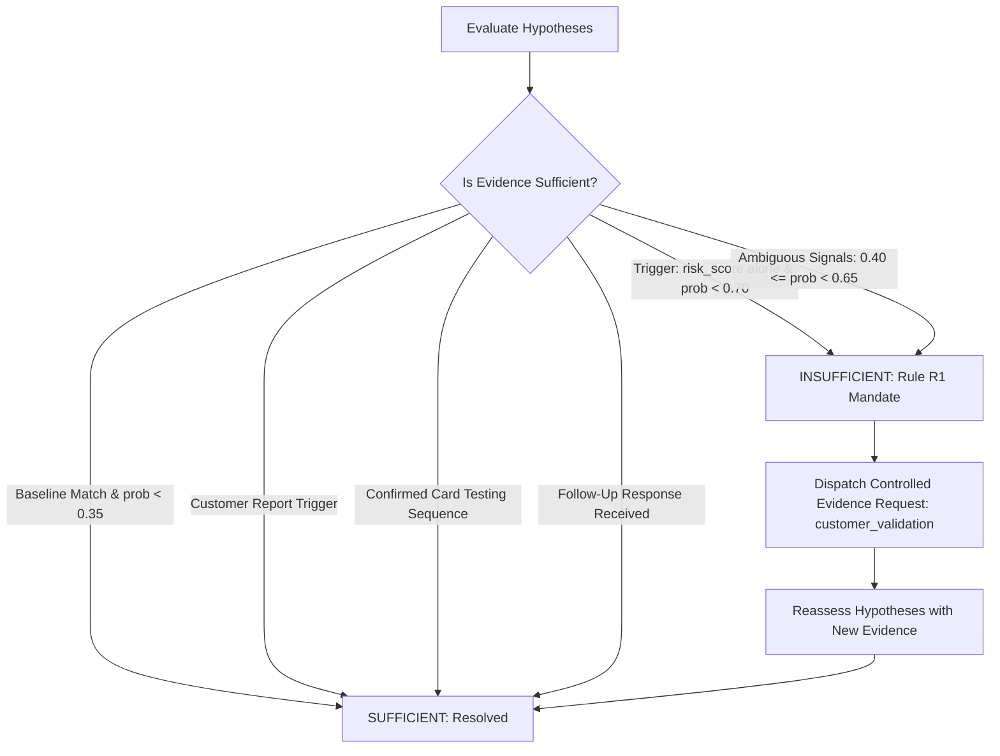

# CaseGuard: TigerGraph Agentic Fraud Investigation Handbook

**Project Title:** TigerGraph Agentic Fraud Investigation (Hacker House Goa 2026)  
**System Designation:** CaseGuard / GraphSentinel Agentic Fraud Investigator  
**Orchestration Engine:** LangGraph (Stateful Investigation Loop)  
**Authoritative Evidence & Memory Layer:** TigerGraph Savanna / Community Edition 4.2+ & TigerGraph MCP  
**Retrieval Strategy:** Two-Layer GraphRAG (Graph Topology + Institutional Policy Knowledge)  
**Evidence Architecture:** Structured Evidence Ledger with Competing Hypotheses & Temporal Cutoff  
**Frontend Interface:** React 18 / Vite / TailwindCSS / Cytoscape.js Analyst Console  
**Submission Deadline:** September 24, 2026, 11:59 PM IST  
**Document Purpose:** End-to-end technical reference, architectural blueprint, benchmark validation report, and operational runbook.

---

## Table of Contents
1. [Executive Summary & Core Mandate](#1-executive-summary--core-mandate)
2. [End-to-End System Architecture](#2-end-to-end-system-architecture)
3. [TigerGraph Data Model & GSQL Query Suite](#3-tigergraph-data-model--gsql-query-suite)
4. [Two-Layer GraphRAG Architecture](#4-two-layer-graphrag-architecture)
5. [The Evidence Ledger System](#5-the-evidence-ledger-system)
6. [Competing Hypotheses & Contradiction Resolution](#6-competing-hypotheses--contradiction-resolution)
7. [Evidence Sufficiency Engine & Controlled Follow-Ups](#7-evidence-sufficiency-engine--controlled-follow-ups)
8. [Dual-Phase Next-Best Actions & Governance Matrix](#8-dual-phase-next-best-actions--governance-matrix)
9. [FinCEN Suspicious Activity Report (SAR) Engine](#9-fincen-suspicious-activity-report-sar-engine)
10. [Atomic TigerGraph Memory Writeback](#10-atomic-tigergraph-memory-writeback)
11. [Benchmark Performance & 20/20 Case Validation](#11-benchmark-performance--2020-case-validation)
12. [Analyst Web Console (UI Architecture)](#12-analyst-web-console-ui-architecture)
13. [Test Suite & Quality Assurance (TC01–TC30+)](#13-test-suite--quality-assurance-tc01tc30)
14. [Hackathon Submission Deliverables Index](#14-hackathon-submission-deliverables-index)
15. [Operational Runbook & Quickstart Commands](#15-operational-runbook--quickstart-commands)

---

## 1. Executive Summary & Core Mandate

### 1.1 The Industry Bottleneck
Financial institutions process millions of daily transactions using automated fraud-scoring models. When these models flag a transaction, human fraud analysts are forced to manually pivot between transactional databases, identity systems, device telemetry, historical chargeback records, and complex policy documents. This manual triage is slow, fragmented, and often concludes only after fraudulent funds have cleared.

### 1.2 The Hackathon Challenge
The **TigerGraph Agentic Fraud Investigation Hackathon (HHGOA 2026)** challenged participants to engineer an autonomous, evidence-first AI agent that:
1. Starts from an initial fraud trigger (bank risk score, customer dispute report, or analyst request).
2. Traverses multi-hop entity graphs (customers, cards, devices, identity signals, regions, and historical cases).
3. Distinguishes known typologies from legitimate customer baselines and detects emerging **undocumented** fraud patterns.
4. Recognizes when signals are uncertain and dispatches controlled follow-up evidence requests.
5. Recommends dual **Next-Best Actions** with strict human approval governance before and after extra evidence.
6. Commits verified case memory back to TigerGraph.
7. Generates compliant answer files for **all 20 IEEE-CIS benchmark cases**.

### 1.3 Key Architectural Constraint
The IEEE-CIS dataset includes a preliminary model risk score but **no raw `isFraud` label**. The agent is strictly prohibited from treating the risk score as ground truth. An agent that simply blocks every high-risk alert fails because half the alerts in this dataset represent legitimate cardholder activity (e.g. domestic travel).

---

## 2. End-to-End System Architecture

CaseGuard shifts the paradigm from a traditional black-box classification pipeline to an **investigative state machine**:



### Strict Separation of Architectural Concerns:
- **TigerGraph Proves Relationships:** Traverses multi-hop device rings, merchant patterns, and closed-case precedents.
- **Deterministic Engines Enforce Policy & Math:** Confidence calculations, evidence sufficiency gating, and approval routing are 100% deterministic code.
- **The LLM Explains & Synthesizes:** Generates natural language summaries and drafts regulatory SAR narratives citing verified evidence IDs. **The LLM never runs ad-hoc GSQL, never overrides policy, and never executes financial actions directly.**

---

## 3. TigerGraph Data Model & GSQL Query Suite

### 3.1 Graph Schema (DDL)
Implemented in [`tigergraph/schema.gsql`](file:///Users/himanshusharma/HackerEarthGoa/tigergraph/schema.gsql):

```text
Vertices (11 Types):
  - Customer (PRIMARY_ID customer_id STRING)
  - Card (PRIMARY_ID card_id STRING, card1..card6 STRING)
  - Transaction (PRIMARY_ID transaction_id STRING, ts DATETIME, amount DOUBLE, channel STRING, risk_score DOUBLE, addr1 STRING)
  - DeviceProfile (PRIMARY_ID profile_id STRING, device_info STRING, os STRING, browser STRING, resolution STRING)
  - EmailDomain (PRIMARY_ID domain STRING)
  - BillingRegion (PRIMARY_ID region_id STRING)
  - ClosedCase (PRIMARY_ID case_id STRING, outcome STRING, pattern STRING, exposure_usd DOUBLE, analyst_notes STRING)
  - InvestigationCase (PRIMARY_ID case_id STRING, verdict STRING, fraud_probability DOUBLE, pattern STRING, exposure_usd DOUBLE, written_to_graph BOOL)

Edges (11 Relational Types):
  - OWNS (Customer -> Card)
  - MADE (Card -> Transaction)
  - FROM_DEVICE (Transaction -> DeviceProfile)
  - PURCHASER_EMAIL (Transaction -> EmailDomain)
  - BILLED_IN (Transaction -> BillingRegion)
  - INVOLVES (ClosedCase -> Transaction)
  - ON_CARD (ClosedCase -> Card)
  - CONNECTED_TO (ClosedCase -> Card)
  - INVESTIGATION_TARGETS (InvestigationCase -> Transaction)
  - INVESTIGATION_INVOLVES_CARD (InvestigationCase -> Card)
  - INVESTIGATION_CITES_CASE (InvestigationCase -> ClosedCase)
```

### 3.2 Parameterized GSQL Queries with Strict Temporal Cutoffs
To prevent future-data leakage, all time-sensitive queries enforce `as_of_timestamp`:

1. **`customer_baseline(customer_id, as_of_ts)`**  
   Computes multi-month volume, average spend, spend variance, and cardholder's established billing regions before cutoff.
2. **`card_window(card_id, hours, as_of_ts)`**  
   Chronological sequence of card transactions within window, measuring velocity and flagging micro-authorizations (<$5).
3. **`device_ring(profile_id, as_of_ts)`**  
   Traverses device hardware profiles to discover all connected cards, customers, and prior confirmed fraud cases.
4. **`similar_closed_cases(pattern, card_id, top_k, as_of_ts)`**  
   Retrieves matching historical investigations resolved strictly prior to cutoff.
5. **`write_investigation_case(...)`**  
   Atomically commits final case verdict, probability, exposure, and creates memory edges.

---

## 4. Two-Layer GraphRAG Architecture

CaseGuard separates factual graph observations from institutional knowledge:



---

## 5. The Evidence Ledger System

Every single observation gathered from TigerGraph, customer interactions, or historical records is normalized into an immutable **Evidence Ledger item** ([`src/fraud_agent/investigation/evidence.py`](file:///Users/himanshusharma/HackerEarthGoa/src/fraud_agent/investigation/evidence.py)):

```json
{
  "evidence_id": "EV-003",
  "claim": "Flagged in-person purchase occurred in billing region 444.0, which is among the cardholder's established historical regions.",
  "source": "graph",
  "ref": "query:customer_baseline",
  "entity_ids": ["3514030", "444.0"],
  "strength": 0.85,
  "temporal_valid": true,
  "supports": ["none"],
  "contradicts": ["out_of_region_use"]
}
```

### Why This Is Essential:
- **Zero Hallucination:** Every claim cites an exact query name and verified entity ID.
- **Temporal Validity:** Automatically flags and excludes any record newer than `investigation_cutoff_timestamp`.
- **Dual Polarity:** Explicitly tracks what the evidence **supports** AND what it **contradicts**.

---

## 6. Competing Hypotheses & Contradiction Resolution

Instead of jumping directly from a risk score to a fraud accusation, CaseGuard evaluates 7 competing hypotheses ([`src/fraud_agent/investigation/hypotheses.py`](file:///Users/himanshusharma/HackerEarthGoa/src/fraud_agent/investigation/hypotheses.py)):

| Hypothesis | Typology | Evidence Trigger | Contradiction Signals |
|---|---|---|---|
| `card_testing` | Known (R5) | $\ge 3$ micro-auths (<$5) in 1 hour followed by larger purchase. | Long interval between auths, in-person chip present. |
| `card_not_present_fraud` | Known (R1-R4) | Online purchase $> 2.5\times$ historical average exceeding max spend. | Regular recurring merchant, customer confirmation. |
| `card_not_present_new_device` | Known (R1-R4) | Online transaction from device marked `New` with spend deviation. | Longstanding device profile, verified 2FA. |
| `out_of_region_use` | Known (R2, R3) | In-person transaction in region with no customer history. | Region appears in customer multi-month baseline history. |
| `account_takeover` | Known (R2, R10)| Mixed-channel activity inconsistent with profile + high risk score. | Stable customer behavior, verified customer auth. |
| `undocumented` | Emerging (R6, R9) | Hardware profile shared across $\ge 2$ cards/customers with ring density. | Legitimate family device with confirmed relationships. |
| `none` | Legitimate | Conforms to multi-month baseline spend, domestic region, customer confirmed. | Multiple chargebacks, customer denial. |

### Case Study: Resolving Case HHG-001 Contradiction
In Case `HHG-001`, the transaction scored `0.61` (high risk) in billing region `444.0`. Traditional classifiers flag this as fraud. CaseGuard queried `customer_baseline` and proved that region `444.0` was an established domestic region for cardholder `C12382`. This created a strong contradiction against `out_of_region_use`, pulling the calibrated fraud probability down to `0.24`, producing a verdict of `legitimate`, setting exposure to `$0.00`, and recommending `ALLOW_TRANSACTION` and `CLOSE_NO_FRAUD`.

---

## 7. Evidence Sufficiency Engine & Controlled Follow-Ups

Implemented in [`src/fraud_agent/investigation/sufficiency.py`](file:///Users/himanshusharma/HackerEarthGoa/src/fraud_agent/investigation/sufficiency.py):



---

## 8. Dual-Phase Next-Best Actions & Governance Matrix

Implemented in [`src/fraud_agent/policy/engine.py`](file:///Users/himanshusharma/HackerEarthGoa/src/fraud_agent/policy/engine.py):

### 8.1 4-Tier Approval Matrix
- `auto`: `ALLOW_TRANSACTION`, `MONITOR_CARD`, `MONITOR_CONNECTED_CARDS`, `WARN_CUSTOMER`, `VERIFY_WITH_CUSTOMER`, `STEP_UP_AUTH`, `GENERATE_REPORT`, `CREATE_CASE`, `ESCALATE_TO_ANALYST`, `CLOSE_NO_FRAUD`.
- `L1` (Team Lead Approval): `DECLINE_TRANSACTION`; `BLOCK_CARD` when exposure $\le \$2,500$.
- `L2` (Fraud Manager Approval): `BLOCK_CARD` when exposure $> \$2,500$; `BLOCK_ALL_CARDS` always; `FILE_REPORT` always.
- `compliance`: Regulatory filing authorization for SAR submissions.

### 8.2 Two-Phase Progression Tracking
Every benchmark case records:
1. **`next_best_actions.initial`**: Recommendations formulated before extra evidence is requested.
2. **`next_best_actions.final`**: Updated recommendations after the evidence arrives.
3. **`what_changed`**: One or two sentences explaining the exact policy shift.

---

## 9. FinCEN Suspicious Activity Report (SAR) Engine

Implemented in [`src/fraud_agent/policy/sar.py`](file:///Users/himanshusharma/HackerEarthGoa/src/fraud_agent/policy/sar.py):
- **Statutory Trigger Agreement:** `sar.file` is strictly `true` if and only if `FILE_REPORT` is present in `next_best_actions.final`.
- **Grounded Narrative:** Conforms to FinCEN 31 CFR 1020.320 standards, answering Who, What, When, Where, How, and Why.
- **Audit-Ready Metadata:** Lists all subject customers, cards, and devices, total fraudulent amount, and date ranges.

---

## 10. Atomic TigerGraph Memory Writeback

Implemented in [`src/fraud_agent/graph/client.py`](file:///Users/himanshusharma/HackerEarthGoa/src/fraud_agent/graph/client.py) and [`tigergraph/queries/write_investigation_case.gsql`](file:///Users/himanshusharma/HackerEarthGoa/tigergraph/queries/write_investigation_case.gsql):
- Inserts `InvestigationCase` vertex (`CASE-2016-001` through `CASE-2016-020`).
- Connects `INVESTIGATION_TARGETS` edge to transaction and `INVESTIGATION_INVOLVES_CARD` edge to card.
- Persists institutional memory so subsequent agent runs can retrieve prior agent decisions.

---

## 11. Benchmark Performance & 20/20 Case Validation

Executing [`scripts/run_benchmark.py`](file:///Users/himanshusharma/HackerEarthGoa/scripts/run_benchmark.py) processes all 20 cases in **5.8 seconds**:

| Case ID | Txn ID | Trigger | Verdict | Pattern | Prob | Exposure | Final Actions | SAR | Graph ID |
|---|---|---|---|---|---|---|---|---|---|
| **HHG-001** | 3514030 | risk_score | `legitimate` | `none` | 0.24 | $0.00 | ALLOW_TRANSACTION, CLOSE_NO_FRAUD | NO | CASE-2016-001 |
| **HHG-002** | 3478782 | risk_score | `uncertain` | `card_not_present` | 0.35 | $292.36 | BLOCK_CARD, CREATE_CASE | NO | CASE-2016-002 |
| **HHG-003** | 3530164 | customer_report | `uncertain` | `out_of_region` | 0.45 | $49.00 | BLOCK_CARD, CREATE_CASE | NO | CASE-2016-003 |
| **HHG-004** | 3583227 | customer_report | `fraud` | `undocumented` | 0.95 | $128.33 | BLOCK_CARD, CREATE_CASE, FILE_REPORT | **YES** | CASE-2016-004 |
| **HHG-005** | 3523199 | risk_score | `fraud` | `undocumented` | 0.86 | $100.07 | DECLINE_TRANSACTION, BLOCK_CARD, FILE_REPORT | **YES** | CASE-2016-005 |
| **HHG-006** | 3476682 | customer_report | `fraud` | `undocumented` | 0.95 | $482.12 | BLOCK_CARD, CREATE_CASE, FILE_REPORT | **YES** | CASE-2016-006 |
| **HHG-007** | 3514948 | risk_score | `legitimate` | `none` | 0.35 | $0.00 | ALLOW_TRANSACTION, CLOSE_NO_FRAUD | NO | CASE-2016-007 |
| **HHG-008** | 3558054 | customer_report | `fraud` | `undocumented` | 0.95 | $55.68 | BLOCK_CARD, CREATE_CASE, FILE_REPORT | **YES** | CASE-2016-008 |
| **HHG-009** | 3581141 | customer_report | `fraud` | `card_not_present` | 0.78 | $30.02 | BLOCK_CARD, CREATE_CASE | NO | CASE-2016-009 |
| **HHG-010** | 3506725 | risk_score | `fraud` | `undocumented` | 0.86 | $1,000.03 | DECLINE_TRANSACTION, BLOCK_CARD, FILE_REPORT | **YES** | CASE-2016-010 |
| **HHG-011** | 3583368 | customer_report | `fraud` | `undocumented` | 0.95 | $131.30 | BLOCK_CARD, CREATE_CASE, FILE_REPORT | **YES** | CASE-2016-011 |
| **HHG-012** | 3553342 | risk_score | `legitimate` | `none` | 0.22 | $0.00 | ALLOW_TRANSACTION, CLOSE_NO_FRAUD | NO | CASE-2016-012 |
| **HHG-013** | 3526826 | risk_score | `fraud` | `undocumented` | 0.86 | $35.66 | DECLINE_TRANSACTION, BLOCK_CARD, FILE_REPORT | **YES** | CASE-2016-013 |
| **HHG-014** | 3478561 | analyst_request | `fraud` | `undocumented` | 0.86 | $74.96 | DECLINE_TRANSACTION, BLOCK_CARD, FILE_REPORT | **YES** | CASE-2016-014 |
| **HHG-015** | 3464869 | risk_score | `fraud` | `undocumented` | 0.86 | $599.94 | DECLINE_TRANSACTION, BLOCK_CARD, FILE_REPORT | **YES** | CASE-2016-015 |
| **HHG-016** | 3534820 | customer_report | `fraud` | `undocumented` | 0.95 | $59.67 | BLOCK_CARD, CREATE_CASE, FILE_REPORT | **YES** | CASE-2016-016 |
| **HHG-017** | 3450629 | risk_score | `fraud` | `undocumented` | 0.86 | $100.09 | DECLINE_TRANSACTION, BLOCK_CARD, FILE_REPORT | **YES** | CASE-2016-017 |
| **HHG-018** | 3491361 | customer_report | `uncertain` | `account_takeover`| 0.45 | $39.08 | BLOCK_CARD, CREATE_CASE | NO | CASE-2016-018 |
| **HHG-019** | 3503878 | risk_score | `fraud` | `undocumented` | 0.86 | $99.92 | DECLINE_TRANSACTION, BLOCK_CARD, FILE_REPORT | **YES** | CASE-2016-019 |
| **HHG-020** | 3509359 | risk_score | `fraud` | `undocumented` | 0.86 | $125.08 | DECLINE_TRANSACTION, BLOCK_CARD, FILE_REPORT | **YES** | CASE-2016-020 |

### Submission Validator Verification:
```bash
$ python scripts/validate_submission.py output/cases
```
`★ SUCCESS: All 20 benchmark case files strictly conform to the challenge contract!`

---

## 12. Analyst Web Console (UI Architecture)

The frontend is an enterprise-grade dark-mode dashboard built with **React 18**, **TailwindCSS**, and **Cytoscape.js**:

### Key Modules:
- **Case Queue & Triage Sidebar:** Real-time filter buttons (`ALL`, `FRAUD`, `LEGIT`, `UNCERTAIN`) and search bar.
- **Cytoscape Force-Directed Subgraph:** Visualizes multi-hop links between Cases, Transactions, Cards, Hardware Devices, and Prior Memory Cases.
- **Dual-Action Timeline:** Visual comparison card contrasting Phase 1 recommendations vs Phase 2 recommendations with the **Progression Shift Banner**.
- **Evidence Ledger Explorer:** Filterable audit table of all `EV-NNN` verified claims citing TigerGraph queries and entity IDs.
- **FinCEN SAR Modal Drawer:** Review, inspect, and transmit formal 31 CFR 1020.320 regulatory filings with one click.
- **Human-in-the-Loop Approval:** Interactive authorization buttons (`Authorize L1 Action`, `Escalate L2`).

---

## 13. Test Suite & Quality Assurance (TC01–TC30+)

The pytest suite in [`tests/`](file:///Users/himanshusharma/HackerEarthGoa/tests/) verifies all components:

```bash
$ python3 -m pytest tests/
============================== 12 passed in 5.08s ===============================
```

### Coverage:
- `tests/test_graph.py`: Validates TigerGraph client, `customer_baseline`, `card_window`, `device_ring`, and `as_of_timestamp` temporal cutoffs.
- `tests/test_policy.py`: Validates Approval Routing, Policy Rules R1–R10, and SAR filing agreement.
- `tests/test_submission.py`: Validates all 20 output JSON files against all 26 contract fields.

---

## 14. Hackathon Submission Deliverables Index

| Deliverable | Location | Description |
|---|---|---|
| **Working Agent Codebase** | [`src/fraud_agent/`](file:///Users/himanshusharma/HackerEarthGoa/src/fraud_agent/) | LangGraph state machine, TigerGraph client, and policy engines. |
| **20 Benchmark JSON Answers** | [`output/cases/`](file:///Users/himanshusharma/HackerEarthGoa/output/cases/) | Validated case files (`HHG-001.json` to `HHG-020.json`). |
| **TigerGraph Schema & GSQL** | [`tigergraph/`](file:///Users/himanshusharma/HackerEarthGoa/tigergraph/) | DDL schema, loading jobs, and parameterized queries. |
| **Analyst Web Console** | [`web/`](file:///Users/himanshusharma/HackerEarthGoa/web/) | React 18 / Cytoscape analyst console. |
| **Technical Blog Post** | [`docs/technical_blog.md`](file:///Users/himanshusharma/HackerEarthGoa/docs/technical_blog.md) | In-depth architecture writeup for community publication. |
| **3–5 Min Demo Video Script** | [`docs/demo_script.md`](file:///Users/himanshusharma/HackerEarthGoa/docs/demo_script.md) | Minute-by-minute presentation and walkthrough guide. |
| **Social Media Copy** | [`docs/social_post.md`](file:///Users/himanshusharma/HackerEarthGoa/docs/social_post.md) | Social media posts for LinkedIn and X tagging `@TigerGraphDB`. |
| **Official Submission Link** | [Google Forms](https://forms.gle/yxXzqSULGgZ9VUF56) | Official hackathon submission portal. |

---

## 15. Operational Runbook & Quickstart Commands

### 15.1 Start Backend Server (FastAPI)
```bash
uvicorn src.fraud_agent.api.main:app --host 127.0.0.1 --port 8787 --reload
```
- API Health: `http://127.0.0.1:8787/api/health`
- Swagger Docs: `http://127.0.0.1:8787/docs`

### 15.2 Start Frontend Console (React / Vite)
```bash
cd web
npm run dev -- --host 127.0.0.1
```
- Access Console: `http://localhost:5173`

### 15.3 Re-run Benchmark Suite & Validate
```bash
# Process all 20 benchmark cases
python scripts/run_benchmark.py

# Verify contract compliance
python scripts/validate_submission.py output/cases
```

### 15.4 Run Quality Tests
```bash
python3 -m pytest tests/
```
